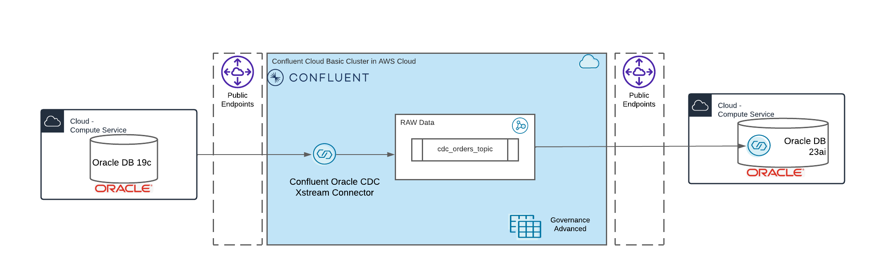

# CDC from Oracle 19c with Confluent Xstream Connector and Sink to Oracle DB 23ai Sink (ATG)

This Demo will show very easily how our new Oracle CDC Connector based on the Oracle XStream Concept will work. We will Synch Order data from Oracle DB 19c to Confluent Cloud.
As additional hightlight we will replicate the raw data into Oracle DB 23ai with integrated Sink connector from Confluent Cloud to Oracle 23ai.



> [!IMPORTANT]
> The new Oracle CDC Connector from Confluent based on the Oracle XStream API is not published yet. The GA rollout is coming soon. Please contact your Confluent Account Team if you would like to know more.

This simple Demo will be added into my [CDC Workshop](https://github.com/ora0600/confluent-cdc-workshop) after new Connector will be GA.

The demo deployment is based on terraform for the most components (Confluent Cloud Cluster, Oracle 19c, Oracle 23ai) only the new Connector will run on local desktop with docker including, connect cluster, Grafana/Prometheus.

## Deploy demo

Get this repos on your desktop

```bash
git clone https://github.com/ora0600/confluent-new-cdc-connector.git
cd confluent-new-cdc-connector
```


4 Simple steps to run this demo:
1. Deploy the Confluent Cloud cluster first with terraform. terraform must be installed on desktop, and you need a Confluent Cloud Account and a Key.
2. Deploy the 19c database in AWS with terraform. You need an aws account, a key, and a ssh key.
3. Deploy the new Connector with Grafana and Prometheus with Docker on your local desktop. You need docker to be installed
4. (optional) Minitor XStream Server
5. Deploy the 23ai database in AWS with terraform. You need an aws account, a key, and a ssh key.


Fill-out the .accounts property file before you start;

```bash
# Confluent Cloud 
export TF_VAR_confluent_cloud_api_key="YOURKEY"
export TF_VAR_confluent_cloud_api_secret="YOURSECRET"
export TF_VAR_cloud_provider="AWS"
export TF_VAR_cc_cloud_region="eu-central-1"
export TF_VAR_cc_env_name="demo-xstream-cdc"
export TF_VAR_cc_cluster_name="cc_aws_cluster"
export TF_VAR_sr_package="ADVANCED"
# AWS Cloud
export aws_access_key="YOURAWSKEY"
export aws_secret_key="YOURAWSSECRET"
export aws_region="eu-central-1"
export ssh_key_name="YOUR SSH KEY"
export ami_oracle19c="ami-YOURORA19C"
export owner_email="YOUR EMAIL"
export myip="YOURMYIP/32"
```

save the .accounts file into main folder.

### 1. Deploy Confluent Cloud Cluster


run terraform:

```bash
cd ccloud-cluster/
source ../.accounts
terraform init
terraform plan
terraform apply
``` 

Confluent Cloud should be created. The Output shows what was created.

### 2. Deploy the Oracle 19c Database

This database is created with a preconfigured image. This will later changed to a free Oracle21c XE container.

run terraform:

```bash
cd ../oracle19c/
source .aws-env
terraform init
terraform plan
terraform apply
```

Terraform will output everything you need to play with Oracle19c:

```bash
A01_DBPUBLICIP = "X.X.X.X"
A02_DBORACLESERVERNAME = "host.compute.amazonaws.com"
A03_DBSSH = "SSH  Access: ssh -i ~/keys/cmawsdemoxstream.pem ec2-user@X.X.X.X "
A04_DBOracleAccess = "sqlplus sys/confluent123@orcl as sysdba or sqlplus sys/confluent123@ORCLPDB1 as sysdba or sqlplus ordermgmt/kafka@ORCLPDB1 sqlplus c##ggadmin/confluent123@ORCLPDB1 Port:1521  HOST:X.X.X.X"
``` 

First we need to add some configds for new CDC Connector in the  database. The main privileges are already set:

```bash
# ssh into Oracle19c compute instances, it takes a while till Oracle DB is up and running
ssh -i ~/keys/cmawsdemoxstream.pem ec2-user@X.X.X.X 
ps -ef | grep ora
# lots of ora processes should run e.g ora_dbw0_ORCLCDB , if you see
# /bin/bash /opt/oracle/runOracle.sh
# /bin/bash /opt/oracle/startDB.sh
# Then DB is still in boot phase
# now configure Xstream
sqlplus c##ggadmin@ORCLCDB
Password is Confluent12!
# execute The CREATE_OUTBOUND procedure in the DBMS_XSTREAM_ADM package is used to create a capture process, queue, and outbound server in a single database
# Depended on your table.include.list in connector setup you would like to add alle tables here: In my case I do have 13 tables, you can use an arry like I do, or a comma sperated list
SQL> DECLARE
  tables  DBMS_UTILITY.UNCL_ARRAY;
  schemas DBMS_UTILITY.UNCL_ARRAY;
BEGIN
    tables(1)   := 'ORDERMGMT.ORDERS';
    tables(2)   := 'ORDERMGMT.ORDER_ITEMS';
    tables(3)   := 'ORDERMGMT.EMPLOYEES';
    tables(4)   := 'ORDERMGMT.PRODUCTS';
    tables(5)   := 'ORDERMGMT.CUSTOMERS';
    tables(6)   := 'ORDERMGMT.INVENTORIES';
    tables(7)   := 'ORDERMGMT.PRODUCT_CATEGORIES';
    tables(8)   := 'ORDERMGMT.CONTACTS';
    tables(9)   := 'ORDERMGMT.NOTES';
    tables(10)  := 'ORDERMGMT.WAREHOUSES';
    tables(11)  := 'ORDERMGMT.LOCATIONS';
    tables(12)  := 'ORDERMGMT.COUNTRIES';
    tables(13)  := 'ORDERMGMT.REGIONS';
    tables(14)  := NULL;
    schemas(1)  := 'ORDERMGMT';        
  DBMS_XSTREAM_ADM.CREATE_OUTBOUND(
    capture_name          =>  'confluent_xout1',
    server_name           =>  'xout',
    source_container_name =>  'ORCLPDB1',
    table_names           =>  tables,
    schema_names          =>  schemas,
    comment               => 'Confluent Xstream CDC Connector' );
-- set rentention
 	DBMS_CAPTURE_ADM.ALTER_CAPTURE(
	  capture_name => 'confluent_xout1',
	  checkpoint_retention_time => 7
	);
END;
/
# You can drop out OUTBOUND Server by
# SQL> execute DBMS_XSTREAM_ADM.DROP_OUTBOUND('XOUT');
# Run order inserts
SQL> connect ordermgmt/kafka@ORCLPDB1
SQL> begin
   produce_orders;
end;
/
```

DB is prepared and Orders will be inserted.


### 3. Deploy the Oracle CDC Connector (XStream)

We need

* Confluent Cloud Cluster is running
* Oracle DB 19c  compute service is running
* We need a Confluent Platform Connect 7.6 or higher. I use Connect latest version in Dokerfile, which is automatically build with docker-compose and for this I used JDK 17, check your java: `java -version`
  - Java Version 17 or higher `java -version`
  - I created a folder `confluent-hub-components` and download there the New CDC Connector.
  - in the folder `confluent-hub-components/<new-connector>/lib/` I copied the files `ojdbc8.jar` and `xstreams.jar` which I download from the instant client for Linux [Download](https://download.oracle.com/otn_software/linux/instantclient/2360000/instantclient-basic-linux.x64-23.6.0.24.10.zip)
  - in the Dockerfile I included the connect container, the Oracle Instant client and set the LD_LIBRARY_PATH env variable (see Dockerfile)
  - If you run a different system then me (MacBook M3, MacOS) you need to find an instant client for your Hardware.
  - We did change the Dockerfile and installed Oracle Instant Client and set LD_LIBRARY_PATH in the docker container. That's why in `docker-compose-cdc-ccloud_new.yml` your will see only `build: .` and this mean, that the container will be build based on the `Dockerfile`.

Start the connect cluster: 

```bash
cd ../cdc-connector
# Start docker Desktop
# start environment, for Confluent colleques: Shutdown VPN, otherwise the Oracle instant client can not be loaded
docker-compose -f docker-compose-cdc-ccloud_new.yml up -d
docker-compose -f docker-compose-cdc-ccloud_new.yml ps
```

This will run on your Desktop, the docker-compose includes connect cluster, Grafana and Prometheus. 
See [Grafana Dashboard](http://localhost:3000/login) login with admin/admin, and check [Prometheus Targets](http://localhost:9090/targets)
You can see in Prometheus if metrics from our connector are published. Open Prometheus UI (http://prometheus:9090/graph).
Run the following query: `{connector="XSTREAMCDC0"}`

We will first check the connect cluster first.

```bash
# Connect cluster status
curl localhost:8083/ | jq
# No running connectors so far
curl localhost:8083/connectors | jq
# One Conenctor plugin for OracleXStreamSourceConnector CDC and mirror maker
curl localhost:8083/connector-plugins/ | jq
```
New XStream Connector can now be deployed:

```bash
# Are connectors running?
curl -s -X GET -H 'Content-Type: application/json' http://localhost:8083/connectors | jq
# start connector with correct json config
curl -s -X POST -H 'Content-Type: application/json' --data @cdc_ccloud.json http://localhost:8083/connectors | jq
# Check status
curl -s -X GET -H 'Content-Type: application/json' http://localhost:8083/connectors/XSTREAMCDC0/status | jq
# check config
curl -s -X GET -H 'Content-Type: application/json' http://localhost:8083/connectors/XSTREAMCDC0/config | jq
# If connector is running, do not delete, only if it fails, then delete and fix the error and start again
# curl -s -X DELETE -H 'Content-Type: application/json' http://localhost:8083/connectors/XSTREAMCDC0 | jq
# RESTART
# curl -s -X POST http://localhost:8083/connectors/XSTREAMCDC0/restart | jq
# curl -s -X GET -H 'Content-Type: application/json' http://localhost:8083/connectors/XSTREAMCDC0/status | jq
```
Connector is running.

Login into Oracle and check if connector is attached to Outboundserver

```bash
ssh -i ~/keys/cmawsdemoxstream.pem ec2-user@PUBIP
sqlplus c##ggadmin@ORCLCDB
# Password Confluent12!
SQL> SELECT CAPTURE_NAME, STATUS FROM ALL_XSTREAM_OUTBOUND WHERE SERVER_NAME = 'XOUT';
# The Server should be attached right now
```

You can check in Confluent Cloud UI all the topics. The `ORCLPDB1.ORDERMGMT.ORDERS` topic should be get events (new orders).

Now, you can play around with the connect

#### large transaction

I try to work now with large transactions. I will insert 1.000.000 regions into the region table with one transaction:

```bash
ssh -i ~/keys/cmawsdemoxstream.pem ec2-user@X.X.X.X 
sqlplus sys/confluent123@ORCLPDB1 as sysdba
SQL> select a.TABLESPACE_NAME, ((a.MAX_SIZE*a.block_Size)/1024/1024/1024) as GB, b.file_name  from dba_tablespaces a, dba_data_files b where a.tablespace_name = 'USERS' and a.tablespace_name = b.tablespace_name;
SQL> alter tablespace USERS add datafile '/opt/oracle/oradata/ORCLCDB/ORCLPDB1/users02.dbf' size 10G;
SQL> select a.TABLESPACE_NAME, ((a.MAX_SIZE*a.block_Size)/1024/1024/1024) as GB, b.file_name  from dba_tablespaces a, dba_data_files b where a.tablespace_name = 'USERS' and a.tablespace_name = b.tablespace_name;
SQL> alter user ordermgmt quota unlimited on USERS;
SQL> connect ordermgmt/kafka@ORCLPDB1
# 1 Mio records in one transaction, in parallel one a couple of inserts in table orders
SQL> begin
  for x in 1..1000000 LOOP
    insert into regions (region_id, region_name) values (2000000+x, 'Region '||to_char(x));
  end loop;
end;
/
SQL> commit;
```

Monitor V$STREAMS_POOL_STATISTICS.TOTAL_MEMORY_ALLOCATED during large transaction to check change of Memory TOTAL_MEMORY_ALLOCATED. And also check SYSAUX Tablespace usage.

```bash
ssh -i ~/keys/cmawsdemoxstream.pem ec2-user@X.X.X.X 
sqlplus sys/confluent123@ORCLPDB1 as sysdba
-- Memory allocated
SQL> select TOTAL_MEMORY_ALLOCATED/1024/1024 as TOTAL_MEMORY_ALLOCATEDMB, current_size/1024/1024 as current_sizeMB from  V$STREAMS_POOL_STATISTICS;
-- SYSAUX Monitor
SQL> COLUMN OCCUPANT_NAME FORMAT A25
SQL> Select OCCUPANT_NAME, SPACE_USAGE_KBYTES/1024 as USEDMB from V$SYSAUX_OCCUPANTS order by 1;
# OCCUPANT_NAME                 USEDMB
# ------------------------- ----------
# STATSPACK                          0
# STREAMS                        .0625
#
# See Oracle Notes for Tablespace estimation, see [documention](https://docs.oracle.com/en/database/oracle/oracle-database/21/admin/managing-tablespaces.html#GUID-C0E5C7A8-8220-48DF-B632-E43D4AE4FA1A)
-- check SYSAUX Tablespace
SQL> col "Tablespace" for a22
SQL> col "Used MB" for 99,999,999
SQL> col "Free MB" for 99,999,999
SQL> col "Total MB" for 99,999,999
SQL> select df.tablespace_name "Tablespace",
       totalusedspace "Used MB",
       (df.totalspace - tu.totalusedspace) "Free MB",
       df.totalspace "Total MB",
       round(100 * ( (df.totalspace - tu.totalusedspace)/ df.totalspace))
       "Pct. Free"
  from (select tablespace_name,
              round(sum(bytes) / 1048576) TotalSpace
         from dba_data_files group by tablespace_name) df,
        (select round(sum(bytes)/(1024*1024)) totalusedspace, 
                tablespace_name
          from dba_segments group by tablespace_name) tu
where df.tablespace_name = tu.tablespace_name
  and tu.tablespace_name = 'SYSAUX'
;
# Tablespace                        Used MB    Free MB   Total MB  Pct. Free
# ------------------------------ ---------- ---------- ---------- ----------
# SYSAUX                                321         19        340          6

# Check what does the Outbound Server in oracle do
SQL> connect sys/confluent123@orclcdb as sysdba
SQL> select component_name, component_type, cumulative_message_count, total_message_count from V$XSTREAM_TRANSACTION where COMPONENT_NAME = 'CONFLUENT_XOUT1' or CUMULATIVE_MESSAGE_COUNT > 0;
# COMPONENT_NAME      COMPONENT_TYPE     CUMULATIVE_MESSAGE_COUNT TOTAL_MESSAGE_COUNT
# -------------------- ------------------- -----------------------  -------------------
# XOUT                 APPLY                2000001                 2000001
SQL> exit
``` 

You see in Connector property setup that I used:
- Large Heapsize of `KAFKA_OPTS: "-javaagent:/usr/share/jmx_exporter/jmx_prometheus_javaagent-1.0.1.jar=1234:/usr/share/jmx_exporter/kafka-connect.yml -Xmx12G -Xms512M"` in docker-compose-cdc-cloud_new.yml file.
- and some connector properties to make snapshot and producer it little bit more faster
```bash              "snapshot.fetch.size":                                  10000, 
              "snapshot.max.threads":                                 4,
              "query.fetch.size":                                     10000,
              "max.queue.size":                                       65536,
              "max.batch.size":                                       16384,
              "producer.override.batch.size":                         204800,
              "producer.override.linger.ms":                          50,
              "heartbeat.interval.ms":                                300000,
```              

Now we have lot of records in our Database REGIONS Tables.

```bash
sqlplus sys/confluent123@orclcdb as sysdba
SQL> set lines 200
COLUMN owner FORMAT A15
COLUMN OBJECT_NAME FORMAT A25
COLUMN SUBOBJECT_NAME FORMAT A15
COLUMN OBJECT_TYPE FORMAT A15
COLUMN NAME FORMAT A15
COLUMN bytes HEADING 'Megabytes' FORMAT 9999999
SELECT o.OWNER , o.OBJECT_NAME , o.SUBOBJECT_NAME , o.OBJECT_TYPE ,
    t.NAME "Tablespace Name", s.growth/(1024*1024) "Growth in MB",
    (SELECT sum(bytes)/(1024*1024)
    FROM dba_segments
    WHERE segment_name=o.object_name) "Total Size(MB)"
FROM DBA_OBJECTS o,
    ( SELECT TS#,OBJ#,
        SUM(SPACE_USED_DELTA) growth
    FROM DBA_HIST_SEG_STAT
    GROUP BY TS#,OBJ#
    HAVING SUM(SPACE_USED_DELTA) > 0
    ORDER BY 2 DESC ) s,
    v$tablespace t
WHERE s.OBJ# = o.OBJECT_ID
AND o.OBJECT_TYPE = 'TABLE'
AND s.TS#=t.TS#
ORDER BY 6 DESC
/
# OUTPUT
# OWNER           OBJECT_NAME               SUBOBJECT_NAME  OBJECT_TYPE     Tablespace Name              Growth in MB Total Size(MB)
# --------------- ------------------------- --------------- --------------- ------------------------------ ------------ --------------
# ORDERMGMT       REGIONS                                   TABLE           USERS                          63.3485899              88
```

So, we have 63MB of data in REGIONS Table. Let's see how the snaphot will go:

```bash
SQL> connect c##ggadmin@ORCLCDB
# Password Confluent12!
SQL> execute DBMS_XSTREAM_ADM.DROP_OUTBOUND('XOUT');
SQL> exit;

# Stop Connector and connect
curl -s -X DELETE -H 'Content-Type: application/json' http://localhost:8083/connectors/XSTREAMCDC0 | jq
docker-compose -f docker-compose-cdc-ccloud_new.ymldown -v
# Delete all topics
#dete all topics to have a clean cluster
confluent kafka topic delete ORCLPDB1.ORDERMGMT.CONTACTS  --force --cluster CLUSTERID --environment ENVID
confluent kafka topic delete ORCLPDB1.ORDERMGMT.COUNTRIES  --force --cluster CLUSTERID --environment ENVID
confluent kafka topic delete ORCLPDB1.ORDERMGMT.CUSTOMERS  --force --cluster CLUSTERID --environment ENVID
confluent kafka topic delete ORCLPDB1.ORDERMGMT.EMPLOYEES  --force --cluster CLUSTERID --environment ENVID
confluent kafka topic delete ORCLPDB1.ORDERMGMT.INVENTORIES  --force --cluster CLUSTERID --environment ENVID
confluent kafka topic delete ORCLPDB1.ORDERMGMT.LOCATIONS  --force --cluster CLUSTERID --environment ENVID
confluent kafka topic delete ORCLPDB1.ORDERMGMT.NOTES  --force --cluster CLUSTERID --environment ENVID
confluent kafka topic delete ORCLPDB1.ORDERMGMT.ORDERS  --force --cluster CLUSTERID --environment ENVID
confluent kafka topic delete ORCLPDB1.ORDERMGMT.ORDER_ITEMS  --force --cluster CLUSTERID --environment ENVID
confluent kafka topic delete ORCLPDB1.ORDERMGMT.PRODUCTS  --force --cluster CLUSTERID --environment ENVID
confluent kafka topic delete ORCLPDB1.ORDERMGMT.REGIONS  --force --cluster CLUSTERID --environment ENVID
confluent kafka topic delete ORCLPDB1.ORDERMGMT.PRODUCT_CATEGORIES  --force --cluster CLUSTERID --environment ENVID
confluent kafka topic delete ORCLPDB1.ORDERMGMT.WAREHOUSES    --force --cluster CLUSTERID --environment ENVID
confluent kafka topic delete __cflt-oracle-heartbeat.ORCLPDB1  --force --cluster CLUSTERID --environment ENVID
confluent kafka topic delete __orcl-schema-changes.cflt  --force --cluster CLUSTERID --environment ENVID
confluent kafka topic delete _confluent-command  --force --cluster CLUSTERID --environment ENVID
confluent kafka topic delete connect1-configs  --force --cluster CLUSTERID --environment ENVID
confluent kafka topic delete connect1-offsets  --force --cluster CLUSTERID --environment ENVID
confluent kafka topic delete connect1-status   --force --cluster CLUSTERID --environment ENVID

# Start Outbound Server again
sqlplus c##ggadmin@ORCLCDB
# Password Confluent12!
DECLARE
  tables  DBMS_UTILITY.UNCL_ARRAY;
  schemas DBMS_UTILITY.UNCL_ARRAY;
BEGIN
    tables(1)   := 'ORDERMGMT.ORDERS';
    tables(2)   := 'ORDERMGMT.ORDER_ITEMS';
    tables(3)   := 'ORDERMGMT.EMPLOYEES';
    tables(4)   := 'ORDERMGMT.PRODUCTS';
    tables(5)   := 'ORDERMGMT.CUSTOMERS';
    tables(6)   := 'ORDERMGMT.INVENTORIES';
    tables(7)   := 'ORDERMGMT.PRODUCT_CATEGORIES';
    tables(8)   := 'ORDERMGMT.CONTACTS';
    tables(9)   := 'ORDERMGMT.NOTES';
    tables(10)  := 'ORDERMGMT.WAREHOUSES';
    tables(11)  := 'ORDERMGMT.LOCATIONS';
    tables(12)  := 'ORDERMGMT.COUNTRIES';
    tables(13)  := 'ORDERMGMT.REGIONS';
    tables(14)  := NULL;
    schemas(1)  := 'ORDERMGMT';        
  DBMS_XSTREAM_ADM.CREATE_OUTBOUND(
    capture_name          =>  'confluent_xout1',
    server_name           =>  'xout',
    source_container_name =>  'ORCLPDB1',
    table_names           =>  tables,
    schema_names          =>  schemas,
    comment               => 'Confluent Xstream CDC Connector' );
-- set rentention
 	DBMS_CAPTURE_ADM.ALTER_CAPTURE(
	  capture_name => 'confluent_xout1',
	  checkpoint_retention_time => 7
	);
END;
/
SQL> exit;

# Start connect
docker-compose -f docker-compose-cdc-ccloud_new.yml up -d
# Create Connector
curl -s -X POST -H 'Content-Type: application/json' --data @cdc_ccloud.json http://localhost:8083/connectors | jq
```

Know the snapshot will work, check grafana snapshot metrics and check REGIONS topic. In Grafana you see great what the Connector in the process of snapshot. The tables were count down, which are remaining so far.
The snapshot was pretty fast, and took only some few minutes for some millions records in total.


#### long running transactions 
sample will coming soon

### 4. Monitor XStream in Oracle DB

You will find some monitor statement in SQL, for checking the Outbound Server status, config and progress

```bash
ssh -i ~/keys/cmawsdemoxstream.pem ec2-user@PUBIP
sqlplus c##ggadmin@ORCLCDB
# XSTream Monitor:
# Sessions
SQL> COLUMN ACTION HEADING 'XStream Component' FORMAT A30
COLUMN SID HEADING 'Session ID' FORMAT 99999
COLUMN SERIAL# HEADING 'Session|Serial|Number' FORMAT 99999999
COLUMN PROCESS HEADING 'Operating System|Process ID' FORMAT A17
COLUMN PROCESS_NAME HEADING 'XStream|Program|Name' FORMAT A7
SELECT /*+PARAM('_module_action_old_length',0)*/ ACTION,
       SID,
       SERIAL#,
       PROCESS,
       SUBSTR(PROGRAM,INSTR(PROGRAM,'(')+1,4) PROCESS_NAME
  FROM V$SESSION
  WHERE MODULE ='XStream';
# XStream Component              Session ID    Number Process ID        Name
# ------------------------------ ---------- --------- ----------------- -------
# XOUT - Apply Coordinator              493     42468 2817              AP02
# XOUT - Propagation Send/Rcv           614     13954 2825              CX01
# CAP$_XOUT_11 - Capture                857     27191 2823              CP02
# XOUT - Apply Reader                   982     40593 2819              AS01
# XOUT - Apply Server                  1228     26514 2821              AS02
# XOUT - Apply Server                  1347      9837 1                 TNS

# Infos, when servers started
SQL> COLUMN STREAMS_NAME FORMAT A12
COLUMN PROCESS_TYPE FORMAT A17
COLUMN EVENT_NAME FORMAT A10
COLUMN DESCRIPTION FORMAT A20
COLUMN EVENT_TIME FORMAT A15
SELECT STREAMS_NAME,
       PROCESS_TYPE,
       EVENT_NAME,
       DESCRIPTION,
       EVENT_TIME
  FROM DBA_REPLICATION_PROCESS_EVENTS;

# outbound server
SQL> COLUMN SERVER_NAME HEADING 'Outbound|Server|Name' FORMAT A10
COLUMN CONNECT_USER HEADING 'Connect|User' FORMAT A10
COLUMN CAPTURE_USER HEADING 'Capture|User' FORMAT A10
COLUMN CAPTURE_NAME HEADING 'Capture|Process|Name' FORMAT A12
COLUMN SOURCE_DATABASE HEADING 'Source|Database' FORMAT A11
COLUMN QUEUE_OWNER HEADING 'Queue|Owner' FORMAT A10
COLUMN QUEUE_NAME HEADING 'Queue|Name' FORMAT A10
SELECT SERVER_NAME, 
       CONNECT_USER, 
       CAPTURE_USER, 
       CAPTURE_NAME,
       SOURCE_DATABASE,
       QUEUE_OWNER,
       QUEUE_NAME
  FROM ALL_XSTREAM_OUTBOUND;
# Outbound                         Capture
# Server     Connect    Capture    Process      Source      Queue      Queue
# Name       User       User       Name         Database    Owner      Name
# ---------- ---------- ---------- ------------ ----------- ---------- ----------
# XOUT       C##GGADMIN C##GGADMIN CAP$_XOUT_11 ORCLPDB1    C##GGADMIN Q$_XOUT_12

# Status and errors
SQL> COLUMN APPLY_NAME HEADING 'Outbound Server|Name' FORMAT A15
COLUMN STATUS HEADING 'Status' FORMAT A8
COLUMN ERROR_NUMBER HEADING 'Error Number' FORMAT 9999999
COLUMN ERROR_MESSAGE HEADING 'Error Message' FORMAT A40
SELECT APPLY_NAME, 
       STATUS,
       ERROR_NUMBER,
       ERROR_MESSAGE
  FROM DBA_APPLY
  WHERE PURPOSE = 'XStream Out';
# Outbound Server
# Name            Status   Error Number Error Message
# --------------- -------- ------------ ----------------------------------------
# XOUT            ENABLED

# Current transaction
SQL> COLUMN SERVER_NAME HEADING 'Outbound|Server|Name' FORMAT A10
COLUMN 'Transaction ID' HEADING 'Transaction|ID' FORMAT A11
COLUMN COMMITSCN HEADING 'Commit SCN' FORMAT 9999999999999
COLUMN COMMIT_POSITION HEADING 'Commit Position' FORMAT A15
COLUMN LAST_SENT_POSITION HEADING 'Last Sent|Position' FORMAT A15
COLUMN MESSAGE_SEQUENCE HEADING 'Message|Number' FORMAT 999999999
SELECT SERVER_NAME,
       XIDUSN ||'.'|| 
       XIDSLT ||'.'||
       XIDSQN "Transaction ID",
       COMMITSCN,
       COMMIT_POSITION,
       LAST_SENT_POSITION,
       MESSAGE_SEQUENCE
  FROM V$XSTREAM_OUTBOUND_SERVER;
# Outbound
# Server     Transaction                                Last Sent          Message
# Name       ID              Commit SCN Commit Position Position            Number
# ---------- ----------- -------------- --------------- --------------- ----------
# XOUT       10.21.1171         3420270 000000000034306 000000000034306          2
#                                       E00000001000000 E00000001000000
#                                       010000000000343 010000000000343
#                                       06E000000010000 06E000000010000
#                                       000102          000102

# Statistics
SQL> COLUMN SERVER_NAME HEADING 'Outbound|Server|Name' FORMAT A8
COLUMN TOTAL_TRANSACTIONS_SENT HEADING 'Total|Trans|Sent' FORMAT 9999999
COLUMN TOTAL_MESSAGES_SENT HEADING 'Total|LCRs|Sent' FORMAT 9999999999
COLUMN BYTES_SENT HEADING 'Total|MB|Sent' FORMAT 99999999999999
COLUMN ELAPSED_SEND_TIME HEADING 'Time|Sending|LCRs|(in seconds)' FORMAT 99999999
COLUMN LAST_SENT_MESSAGE_NUMBER HEADING 'Last|Sent|Message|Number' FORMAT 99999999
COLUMN LAST_SENT_MESSAGE_CREATE_TIME HEADING 'Last|Sent|Message|Creation|Time' FORMAT A9
SELECT SERVER_NAME,
       TOTAL_TRANSACTIONS_SENT,
       TOTAL_MESSAGES_SENT,
       (BYTES_SENT/1024)/1024 BYTES_SENT,
       (ELAPSED_SEND_TIME/100) ELAPSED_SEND_TIME,
       LAST_SENT_MESSAGE_NUMBER,
       TO_CHAR(LAST_SENT_MESSAGE_CREATE_TIME,'HH24:MI:SS MM/DD/YY') 
          LAST_SENT_MESSAGE_CREATE_TIME
  FROM V$XSTREAM_OUTBOUND_SERVER;
# Outbound    Total       Total           Total      Sending      Sent Message
# Server      Trans        LCRs              MB         LCRs   Message Creation
# Name         Sent        Sent            Sent (in seconds)    Number Time
# -------- -------- ----------- --------------- ------------ --------- ---------
# XOUT          289     1000577             287            0   3420355 08:55:48
                                                                     02/26/25

# outbound parameters
SQL> COLUMN APPLY_NAME HEADING 'Outbound Server|Name' FORMAT A15
COLUMN PARAMETER HEADING 'Parameter' FORMAT A30
COLUMN VALUE HEADING 'Value' FORMAT A22
COLUMN SET_BY_USER HEADING 'Set by|User?' FORMAT A10
SELECT APPLY_NAME,
       PARAMETER, 
       VALUE,
       SET_BY_USER  
  FROM ALL_APPLY_PARAMETERS a, ALL_XSTREAM_OUTBOUND o
  WHERE a.APPLY_NAME=o.SERVER_NAME
  ORDER BY a.PARAMETER;
SQL> exit
exit
```

### 5. Sink to Orcle 23ai

coming soon


