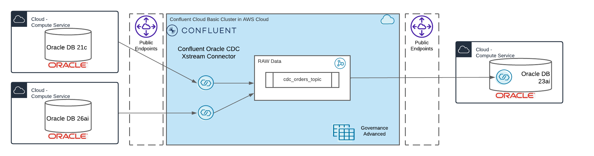

# CDC from Oracle 21c with Confluent Xstream Connector and Sink to Oracle DB 23ai Sink (ATG)

This Demo will show very easily how our new Oracle CDC Connector based on the Oracle XStream Concept will work. We will Synch Order data from Oracle DB 21c to Confluent Cloud.
As additional hightlight we will replicate the raw data into Oracle DB 23ai with integrated Consumer in Database from Confluent Cloud to Oracle 23ai.



> [!IMPORTANT]
> The new Oracle CDC Connector from Confluent based on the Oracle XStream API is GA. Please install the connector into cdc-connector/confluent-hub-components (or use the fully-managed version).

> [!CAUTION]
> The workshop was tested with MacBook Pro M3. If you run Apple Mac Silicon processor please [prepare](https://medium.com/@immanoj42/terraform-template-v2-2-0-does-not-have-a-package-available-mac-m1-m2-2b12c6281ea), so that your terraform execution is working fine.

This simple Demo will be added into my [CDC Workshop](https://github.com/ora0600/confluent-cdc-workshop) after new Connector will be GA.

The demo deployment is based on terraform for the most components (Confluent Cloud Cluster, Oracle 21c, Oracle 23ai) only the new Connector will run on local desktop with docker including, connect cluster, Grafana/Prometheus.

# Table of Contents
[Deploy Demo](#deploy-demo)
1. [Deploy Confluent Cloud Cluster](#1-deploy-confluent-cloud-cluster)
2. [Deploy the Oracle Database](#2-deploy-the-oracle-database)
3. [Deploy the Oracle CDC Connector (XStream)](#3-deploy-the-oracle-cdc-connector-xstream)
   - [fully-managed connector](#fully-managed-connector)
   - [self-managed Connector](#self-managed-connector)
   - [large transaction](#large-transaction)
   - [long running transactions](#long-running-transactions)
4. [Monitor XStream in oracle DB](#4-monitor-xstream-in-oracle-db)   
5. [Sink to Oracle 23ai](#5-sink-to-orcle-23ai)
   - [Loading Data Into a Streaming Mode Application](#loading-data-into-a-streaming-mode-application)
6. [Prod Cases](#6-prod-cases)
7. [add new table[(#7-add-new-table)
8. [Destroy everyting](#8-destroy-everyting)


## Deploy demo

Get this repository on your desktop

```bash
git clone https://github.com/ora0600/confluent-new-cdc-connector.git
cd confluent-new-cdc-connector
```


5 Simple steps to run this demo:
1. Deploy the Confluent Cloud cluster first with terraform. terraform must be installed on desktop, and you need a Confluent Cloud Account and a Key.
2. Deploy the 19c database in AWS with terraform. You need an aws account, a key, and a ssh key.
3. Deploy the new Connector with Grafana and Prometheus with Docker on your local desktop. You need docker to be installed
4. (optional) Monitor XStream Server
5. Deploy the 23ai database in AWS with terraform. You need an aws account, a key, and a ssh key.


Fill-out the .accounts property file before you start;

```bash
# Confluent Cloud 
export TF_VAR_confluent_cloud_api_key="YOURKEY"
export TF_VAR_confluent_cloud_api_secret="YOURSECRET"
export TF_VAR_cloud_provider="AWS"
export TF_VAR_cc_cloud_region="eu-central-1"
export TF_VAR_cc_env_name="demo-xstream-cdc"
export TF_VAR_cc_cluster_name="cc_aws_cluster"
export TF_VAR_sr_package="ADVANCED"
# AWS Cloud
export aws_access_key="YOURAWSKEY"
export aws_secret_key="YOURAWSSECRET"
export aws_region="eu-central-1"
export ssh_key_name="YOUR SSH KEY"
# The next one not needed anymore
#export ami_oracle19c="ami-YOURORA19C"
export owner_email="YOUR EMAIL"
export myip="YOURMYIP/32"
```

save the .accounts file into main folder.

### 1. Deploy Confluent Cloud Cluster


run terraform:

```bash
cd ccloud-cluster/
source ../.accounts
terraform init
terraform plan
terraform apply
``` 

Confluent Cloud should be created. The Output shows what was created.

### 2. Deploy the Oracle Database

> [!IMPORTANT]
> Please be prepared and informed that the DB Port 1521 will automatically get a AWS Security Policy to allow only the MYIP and the Confluent Cloud Cluster egress IPs (if set from confluent) to access. If this is not your plan, change your policy in `main.tf` for Port 1521: e.g. to allow all `cidr_blocks = [0.0.0.0/0]` 


Oracle 21c XE build during runtime:
run terraform:

```bash
cd ../oraclexe21c/
source .aws-env
terraform init
terraform plan
terraform apply
```

Terraform will output everything you need to play with Oracle21c:

```bash
A01_PUBLICIP = "X.X.X.X"
A02_ORACLESERVERNAME = "X.X.X.X"
A03_SSH = "SSH  Access: ssh -i ~/keys/cmawsdemoxstream.pem ec2-user@X.X.X.X "
A04_OracleAccess = "sqlplus sys/confluent123@XE as sysdba or sqlplus sys/confluent123@XEPDB1 as sysdba or sqlplus ordermgmt/kafka@XEPDB1  c##ggadmin/Confluent12!@XE Port:1521  HOST:X.X.X.X"
``` 


First we need to add some config for new CDC Connector in the database. The CDC Connector need an Outbound Server in Oracle DB. The main privileges are already set:

```bash
# ssh into Oracle19c compute instances, it takes a while till Oracle DB is up and running
ssh -i ~/keys/cmawsdemoxstream.pem ec2-user@X.X.X.X 
ps -ef | grep XE  # if your run 21c
# You can also check the logs
sudo tail -f /var/log/cloud-init-output.log

# lots of ora processes should run e.g ora_dbw0_XE , if you see
# /bin/bash /opt/oracle/runOracle.sh
# /bin/bash /opt/oracle/startDB.sh
# Then DB is still in boot phase
sudo docker exec -it oracle21c /bin/bash
# Please check redos first
sqlplus sys/confluent123@XE as sysdba
SQL> set lines 200
COLUMN MEMBER FORMAT A40
COLUMN MEMBERS FORMAT 999
SELECT a.group#,b.member,a.members, a.bytes/1024/1024 as MB, a.status FROM v$log a,v$logfile b WHERE a.group# = b.group#;
# If you see redo1-3 please drop them, e.g. in my case
#   GROUP#  MEMBER                            MEMBERS  MB       STATUS
# -------- --------------------------------- --------- -------  ------
#        1 /opt/oracle/oradata/XE/redo01.log 1         200      INACTIVE
# Drop old REDO         
ALTER DATABASE DROP LOGFILE GROUP 1; 
# We need only these REDOS
#   GROUP#  MEMBER                            MEMBERS  MB       STATUS
# -------- --------------------------------- --------- -------  ------
#        4 /opt/oracle/oradata/XE/redo04.log 1         2048     CURRENT
#        5 /opt/oracle/oradata/XE/redo05.log 1         2048     UNUSED
#        6 /opt/oracle/oradata/XE/redo06.log 1         2048     UNUSED

# now configure Xstream
SQL> connect c##ggadmin@XE
Password is Confluent12!
# execute The CREATE_OUTBOUND procedure in the DBMS_XSTREAM_ADM package is used to create a capture process, queue, and outbound server in a single database
# Depended on your table.include.list in connector setup you would like to add alle tables here: In my case I do have 13 tables, you can use an arry like I do, or a comma sperated list
SQL> DECLARE
  tables  DBMS_UTILITY.UNCL_ARRAY;
  schemas DBMS_UTILITY.UNCL_ARRAY;
BEGIN
    tables(1)   := 'ORDERMGMT.ORDERS';
    tables(2)   := 'ORDERMGMT.ORDER_ITEMS';
    tables(3)   := 'ORDERMGMT.EMPLOYEES';
    tables(4)   := 'ORDERMGMT.PRODUCTS';
    tables(5)   := 'ORDERMGMT.CUSTOMERS';
    tables(6)   := 'ORDERMGMT.INVENTORIES';
    tables(7)   := 'ORDERMGMT.PRODUCT_CATEGORIES';
    tables(8)   := 'ORDERMGMT.CONTACTS';
    tables(9)   := 'ORDERMGMT.NOTES';
    tables(10)  := 'ORDERMGMT.WAREHOUSES';
    tables(11)  := 'ORDERMGMT.LOCATIONS';
    tables(12)  := 'ORDERMGMT.COUNTRIES';
    tables(13)  := 'ORDERMGMT.REGIONS';
    tables(14)  := NULL;
    schemas(1)  := 'ORDERMGMT';        
  DBMS_XSTREAM_ADM.CREATE_OUTBOUND(
    capture_name          =>  'confluent_xout1',
    server_name           =>  'xout',
    source_container_name =>  'XEPDB1',   
    table_names           =>  tables,
    schema_names          =>  schemas,
    comment               => 'Confluent Xstream CDC Connector' );
-- set rentention
    DBMS_CAPTURE_ADM.ALTER_CAPTURE(
      capture_name => 'confluent_xout1',
      checkpoint_retention_time => 7
    );
END;
/
# You can drop out OUTBOUND Server by
# SQL> execute DBMS_XSTREAM_ADM.DROP_OUTBOUND('XOUT');
# Run order inserts
SQL> connect ordermgmt/kafka@XEPDB1 
SQL> begin
   produce_orders;
end;
/
```

DB is prepared and Orders will be inserted.

### 3. Deploy the Oracle CDC Connector (XStream)

We need to continue to be pretty sure, that the following steps are finished.

* Confluent Cloud Cluster is running
* Oracle DB 21c  compute service is running
* We need a Confluent Platform Connect 7.6 or higher. I use Connect latest version in Dokerfile, which is automatically build with running docker-compose and for this I used JDK 17, check your java: `java -version`
  - Java Version 17 or higher `java -version`
  - I created a folder `cdc-connector/confluent-hub-components` and downloaded there the New CDC Connector zip und unzipped it.
  - in the folder `confluent-hub-components/<new-connector>/lib/` I copied the files `ojdbc8.jar` and `xstreams.jar` which I download from the instant client for Linux [Download](hhttps://download.oracle.com/otn_software/linux/instantclient/1926000/instantclient-basic-linux.arm64-19.26.0.0.0dbru.zip)
  - in the Dockerfile I included in the connect container the Oracle Instant client and set the LD_LIBRARY_PATH env variable (see `Dockerfile`)
  - If you run a different system then me (MacBook M3, MacOS) you need to find an instant client for other Hardware.
  - We did change the the Dockerfile and installed Oracle Instant Client and set LD_LIBRARY_PATH in the docker container. That's why in `docker-compose-cdc-ccloud_new.yml` your will see only `build: .` and this mean, that the container will build based on the `Dockerfile`.

> [!IMPORTANT]
> the handling with the instant client must be fit your OS and HW setup. I am running Apple M3 HW on MacOs, that's why I download  `https://download.oracle.com/otn_software/linux/instantclient/1926000/instantclient-basic-linux.arm64-19.26.0.0.0dbru.zip` and in DockerFile I use `https://download.oracle.com/otn_software/linux/instantclient/1926000/instantclient-basic-linux.arm64-19.26.0.0.0dbru.zip`. You see the common piece is ARM64 HW here for my setup. For your setup you may need different Zips.

You can run the connector 
* in Confluent Cloud as fully-managed connector or
* self-managed on your desktop  with docker.

#### fully-managed connector

Run terraform

if you run with Oracle 19c EE prepared image you need to run with in `cflt_connectors.tf`

```java
              "database.dbname":                                      "ORCLCDB",
              "database.service.name":                                "ORCLCDB",
              "database.pdb.name":                                    "ORCLPDB1",
              "topic.prefix":                                         "ORCLPDB1",
```

If you run with Oracle XE 21c you do not need to change the `cflt_connectors.tf`

> [!IMPORTANT]
> If you run fully-managedc connector then we run with AVRO, so Oracle 23ai sample would not work here.


```bash
cd ../cdc-connector
source .ccloud_env
terraform init
terraform plan
terraform apply
```

The fully managed connector should now run in Confluent Cloud.

#### self-managed Connector

Before starting the connect cluster, be sure that Docker Desktop is running.

```bash
docker ps
```

> [!IMPORTANT]
> If you run self-managedc connector then we run with JSON with SR, so Oracle 23ai sample would work here.

Start the connect cluster: 

```bash
cd ../cdc-connector
# start environment, for Confluent colleques: Shutdown VPN, otherwise the instant client can not be loaded
docker-compose -f docker-compose-cdc-ccloud_new.yml up -d
docker-compose -f docker-compose-cdc-ccloud_new.yml ps
```

Connect-Cluster will run on your Desktop, the docker-compose includes connect cluster, Grafana and Prometheus. 
See [Grafana Dashboard](http://localhost:3000/login) login with admin/admin, and check [Prometheus Targets](http://localhost:9090/targets)
You can in Prometheus search for connector metrics from XStream connector if you created the connector (we be do later). Open Prometheus UI (http://prometheus:9090/graph).
Run the following query: `{connector="XSTREAMCDC0"}` if connector is running.

We will first check the connect cluster first.

```bash
# Connect cluster status
curl localhost:8083/ | jq
# No running connectors so far
curl localhost:8083/connectors | jq
# One Conenctor plugin for OracleXStreamSourceConnector CDC and mirror maker
curl localhost:8083/connector-plugins/ | jq
```

> [!IMPORTANT]
> > [!IMPORTANT]
> Please be informed that this connector is GA since 23 April 2025. You need to use a new property: `Name: database.processor.licenses`. This is a required configuration on CC and optional on CP. Which is not covered here, yet. Please install connector into cdc-connector/confluent-hub-components (or use the fully-managed version)


> [!CAUTON]
> I did setup JSON as schema format without SR. This because I wanted to make the sink into Oracle 23ai simpler. If you need JSON_SR or AVRO or PROTOBUF, please change the config.


Start Connector

```bash
# Are connectors running?
curl -s -X GET -H 'Content-Type: application/json' http://localhost:8083/connectors | jq
# start connector with correct json config
curl -s -X POST -H 'Content-Type: application/json' --data @cdc_ccloud.json http://localhost:8083/connectors | jq
# Check status
curl -s -X GET -H 'Content-Type: application/json' http://localhost:8083/connectors/XSTREAMCDC0/status | jq
# check config
curl -s -X GET -H 'Content-Type: application/json' http://localhost:8083/connectors/XSTREAMCDC0/config | jq
# Set log level to debug
# curl -Ss http://localhost:8083/admin/loggers | jq
# curl -s -X PUT -H "Content-Type:application/json" http://localhost:8083/admin/loggers/io.confluent.connect.oracle.xstream.cdc.OracleXStreamSourceConnector -d '{"level": "DEBUG"}'
#trace
# curl -s -X PUT -H "Content-Type:application/json" http://localhost:8083/admin/loggers/io.confluent.connect.oracle.xstream.cdc.OracleXStreamSourceConnector -d '{"level": "TRACE"}'
# Worker
# curl -Ss http://localhost:8083/admin/loggers/org.apache.kafka.connect.runtime.WorkerSourceTask | jq
# Set worker trace
# curl -s -X PUT -H "Content-Type:application/json" http://localhost:8083/admin/loggers/org.apache.kafka.connect.runtime.WorkerSourceTask -d '{"level": "TRACE"}' | jq '.'
# If connector is running, do not delete, only if it fails, then delete and fix the error and start again
# curl -s -X DELETE -H 'Content-Type: application/json' http://localhost:8083/connectors/XSTREAMCDC0 | jq
# RESTART
# curl -s -X POST http://localhost:8083/connectors/XSTREAMCDC0/restart | jq
# curl -s -X GET -H 'Content-Type: application/json' http://localhost:8083/connectors/XSTREAMCDC0/status | jq
```

Connector is running.

Excercise:
* Pause Connector
* check what is in orders topic: Remember the order_id and offset (in my case: oderid=6649, Offset 6647)
* resume the connector and check if the missing order_id is complete there shoould not a gap
* now, simulate an error: Stop the connector. Remember the offset in orders topic (Oder_id=6677, offset=6675)
* Restart the connector now


```bash
# pause connector
curl -s -X PUT -H 'Content-Type: application/json' http://localhost:8083/connectors/XSTREAMCDC0/pause | jq
curl -s -X GET -H 'Content-Type: application/json' http://localhost:8083/connectors/XSTREAMCDC0/status | jq
# resume connector
curl -s -X PUT -H 'Content-Type: application/json' http://localhost:8083/connectors/XSTREAMCDC0/resume | jq
curl -s -X GET -H 'Content-Type: application/json' http://localhost:8083/connectors/XSTREAMCDC0/status | jq
# stop the connector
curl -s -X PUT -H 'Content-Type: application/json' http://localhost:8083/connectors/XSTREAMCDC0/stop | jq
curl -s -X GET -H 'Content-Type: application/json' http://localhost:8083/connectors/XSTREAMCDC0/status | jq
# restart the connector after stop
curl -s -X PUT -H 'Content-Type: application/json' http://localhost:8083/connectors/XSTREAMCDC0/resume | jq
curl -s -X GET -H 'Content-Type: application/json' http://localhost:8083/connectors/XSTREAMCDC0/status | jq
```

Login into Oracle and check if connector is attached to Outboundserver

```bash
ssh -i ~/keys/cmawsdemoxstream.pem ec2-user@PUBIP
sudo docker exec -it oracle21c /bin/bash
sqlplus c##ggadmin@XE
# Password Confluent12!
SQL> SELECT CAPTURE_NAME, STATUS FROM ALL_XSTREAM_OUTBOUND WHERE SERVER_NAME = 'XOUT';
# The Server should be attached right now
```

You can check in Confluent Cloud UI all the topics. The `XEPDB1.ORDERMGMT.ORDERS` topic should be get events (new orders).

Now, you can play around with the connector

#### large transaction

For running the next cases, I did the following change:

* REDLOG File size 2G
* SGA=42GB (not working on XE)
* PGA=14GB (not working on XE)
* Made Logging asynchronous
* Connect heapsize: Ensure sufficient memory is allocated to the Connect worker (-Xms4g -Xmx8g): `KAFKA_OPTS: "-javaagent:/usr/share/jmx_exporter/jmx_prometheus_javaagent-1.0.1.jar=1234:/usr/share/jmx_exporter/kafka-connect.yml -Xmx8G -Xms4G"`
* all this has to be setup automatically during database setup, see [01_setup_database.sql](https://github.com/ora0600/confluent-new-cdc-connector/blob/master/oraclexe21c/docker/scripts/01_setup_database.sql)


> [!IMPORTANT]
> If you go with XE Edition 21c, then we are limited to 2GB RAM only, sorry, that's why change SGA and PGA will not work with XE, we do only  `alter system set sga_target=1G scope=spfile sid='*';` 
> and `ALTER SYSTEM SET pga_aggregate_limit=1G SCOPE=BOTH;` Keep in mind that XE is limited, a real test would not generate best results with XE. XE is only for trail cases, where no license from Oracle is needed.

I try to work now with large transactions. I will insert 2.000.000 regions into the region table with one transaction, you will see with the XE this would take a while because of the limited resources of XE. The main bottleneck here is the limited size fo the memory. If set values like mentioned above, it would run much more faster:

```bash
ssh -i ~/keys/cmawsdemoxstream.pem ec2-user@X.X.X.X 
sudo docker exec -it oracle21c /bin/bash
sqlplus sys/confluent123@XEPDB1 as sysdba
SQL> select a.TABLESPACE_NAME, ((a.MAX_SIZE*a.block_Size)/1024/1024/1024) as GB, b.file_name  from dba_tablespaces a, dba_data_files b where a.tablespace_name = 'USERS' and a.tablespace_name = b.tablespace_name;
SQL> alter tablespace USERS add datafile '/opt/oracle/oradata/XE/XEPDB1/users02.dbf' size 10G;
SQL> select a.TABLESPACE_NAME, ((a.MAX_SIZE*a.block_Size)/1024/1024/1024) as GB, b.file_name  from dba_tablespaces a, dba_data_files b where a.tablespace_name = 'USERS' and a.tablespace_name = b.tablespace_name;
SQL> alter user ordermgmt quota unlimited on USERS;
SQL> connect ordermgmt/kafka@XEPDB1
# 2 Mio records in one transaction, in parallel one a couple of inserts in table orders
SQL> begin
  for x in 1..2000000 LOOP
    insert into regions (region_id, region_name) values (4000000+x, 'Region '||to_char(x));
  end loop;
end;
/
SQL> commit;
SQL> connect c##ggadmin@XE
Password: Confluent12!
-- Latency of Capture
SQL> SELECT
  CAPTURE_NAME,
  ((SYSDATE - CAPTURE_MESSAGE_CREATE_TIME)*86400) LATENCY_SECONDS
FROM
  V$XSTREAM_CAPTURE;
# Name            LATENCY_SECONDS
# --------------- ---------------
# CONFLUENT_XOUT1               2
-- Total send MB so far
SQL> COLUMN SERVER_NAME HEADING 'Outbound|Server|Name' FORMAT A8
COLUMN TOTAL_TRANSACTIONS_SENT HEADING 'Total|Trans|Sent' FORMAT 9999999
COLUMN TOTAL_MESSAGES_SENT HEADING 'Total|LCRs|Sent' FORMAT 9999999999
COLUMN BYTES_SENT HEADING 'Total|MB|Sent' FORMAT 99999999999999
COLUMN ELAPSED_SEND_TIME HEADING 'Time|Sending|LCRs|(in seconds)' FORMAT 99999999
COLUMN LAST_SENT_MESSAGE_NUMBER HEADING 'Last|Sent|Message|Number' FORMAT 99999999
COLUMN LAST_SENT_MESSAGE_CREATE_TIME HEADING 'Last|Sent|Message|Creation|Time' FORMAT A9
SELECT SERVER_NAME,
       TOTAL_TRANSACTIONS_SENT,
       TOTAL_MESSAGES_SENT,
       (BYTES_SENT/1024)/1024 BYTES_SENT,
       (ELAPSED_SEND_TIME/100) ELAPSED_SEND_TIME,
       LAST_SENT_MESSAGE_NUMBER,
       TO_CHAR(LAST_SENT_MESSAGE_CREATE_TIME,'HH24:MI:SS MM/DD/YY') 
          LAST_SENT_MESSAGE_CREATE_TIME
  FROM V$XSTREAM_OUTBOUND_SERVER;
# Outbound    Total       Total           Total      Sending      Sent Message
# Server      Trans        LCRs              MB         LCRs   Message Creation
# Name         Sent        Sent            Sent (in seconds)    Number Time
# -------- -------- ----------- --------------- ------------ --------- ---------
# XOUT           93      818750             230            0   3760415 13:50:29
                                                                     03/18/25
```

Monitor V$STREAMS_POOL_STATISTICS.TOTAL_MEMORY_ALLOCATED during large transaction to check change of Memory TOTAL_MEMORY_ALLOCATED. And also check SYSAUX Tablespace usage.

```bash
ssh -i ~/keys/cmawsdemoxstream.pem ec2-user@X.X.X.X 
sudo docker exec -it oracle21c /bin/bash
sqlplus sys/confluent123@XEPDB1 as sysdba
-- Memory allocated
SQL> select TOTAL_MEMORY_ALLOCATED/1024/1024 as TOTAL_MEMORY_ALLOCATED_MB, current_size/1024/1024 as current_size_MB from  V$STREAMS_POOL_STATISTICS;
-- SYSAUX Monitor
SQL> COLUMN OCCUPANT_NAME FORMAT A25
Select OCCUPANT_NAME, SPACE_USAGE_KBYTES/1024 as USEDMB from V$SYSAUX_OCCUPANTS order by 1;
# OCCUPANT_NAME                 USEDMB
# ------------------------- ----------
# STATSPACK                          0
# STREAMS                        .0625
#
# See Oracle Notes for Tablespace estimation, see [documention](https://docs.oracle.com/en/database/oracle/oracle-database/21/admin/managing-tablespaces.html#GUID-C0E5C7A8-8220-48DF-B632-E43D4AE4FA1A)
-- check SYSAUX Tablespace
SQL> col "Tablespace" for a22
SQL> col "Used MB" for 99,999,999
SQL> col "Free MB" for 99,999,999
SQL> col "Total MB" for 99,999,999
SQL> select df.tablespace_name "Tablespace",
       totalusedspace "Used MB",
       (df.totalspace - tu.totalusedspace) "Free MB",
       df.totalspace "Total MB",
       round(100 * ( (df.totalspace - tu.totalusedspace)/ df.totalspace))
       "Pct. Free"
  from (select tablespace_name,
              round(sum(bytes) / 1048576) TotalSpace
         from dba_data_files group by tablespace_name) df,
        (select round(sum(bytes)/(1024*1024)) totalusedspace, 
                tablespace_name
          from dba_segments group by tablespace_name) tu
where df.tablespace_name = tu.tablespace_name
  and tu.tablespace_name = 'SYSAUX'
;
# Tablespace                        Used MB    Free MB   Total MB  Pct. Free
# ------------------------------ ---------- ---------- ---------- ----------
# SYSAUX                                321         19        340          6

# Check what does the Outbound Server in oracle do
SQL> connect sys/confluent123@XE as sysdba
SQL> select component_name, component_type, cumulative_message_count, total_message_count from V$XSTREAM_TRANSACTION where COMPONENT_NAME = 'CONFLUENT_XOUT1' or CUMULATIVE_MESSAGE_COUNT > 2;
# COMPONENT_NAME      COMPONENT_TYPE     CUMULATIVE_MESSAGE_COUNT TOTAL_MESSAGE_COUNT
# -------------------- ------------------- -----------------------  -------------------
# XOUT                 APPLY                2000001                 2000001
SQL> exit
``` 

The `cdc_ccloud.json` shows the current connector setup:
- Large Heapsize of `KAFKA_OPTS: "-javaagent:/usr/share/jmx_exporter/jmx_prometheus_javaagent-1.0.1.jar=1234:/usr/share/jmx_exporter/kafka-connect.yml -Xmx8G -Xms4G"` in docker-compose-cdc-cloud_new.yml file.
- and some connector properties to make snapshot and producer a little bit more faster
- everything is already setuped

For snapshot tuning keep these parameter in consideraton:

* snapshot.fetch.size, 
* snapshot.max.threads, 
* max.queue.size, 
* max.batch.size
* And the Kafka producer is tuned for high throughput using the following configurations: producer.override.batch.size, producer.override.linger.ms

Please check your connectoer property file `cdc_ccloud.json` 

```bash              
              "snapshot.fetch.size":                                  10000, 
              "snapshot.max.threads":                                 4,
              "query.fetch.size":                                     10000,
              "max.queue.size":                                       65536,
              "max.batch.size":                                       16384,
              "producer.override.batch.size":                         204800,
              "producer.override.linger.ms":                          50,
              "heartbeat.interval.ms":                                300000,
```              

Now we have lot of records in our Database REGIONS Tables. The following statement need DB management pack to view the DBA_HIST_SEG_STAT, please keep this in mind.

```bash
sqlplus sys/confluent123@XE as sysdba
SQL> set lines 200
COLUMN owner FORMAT A15
COLUMN OBJECT_NAME FORMAT A25
COLUMN SUBOBJECT_NAME FORMAT A15
COLUMN OBJECT_TYPE FORMAT A15
COLUMN NAME FORMAT A15
COLUMN bytes HEADING 'Megabytes' FORMAT 9999999
SELECT o.OWNER , o.OBJECT_NAME , o.SUBOBJECT_NAME , o.OBJECT_TYPE ,
    t.NAME "Tablespace Name", s.growth/(1024*1024) "Growth in MB",
    (SELECT sum(bytes)/(1024*1024)
    FROM dba_segments
    WHERE segment_name=o.object_name) "Total Size(MB)"
FROM DBA_OBJECTS o,
    ( SELECT TS#,OBJ#,
        SUM(SPACE_USED_DELTA) growth
    FROM DBA_HIST_SEG_STAT
    GROUP BY TS#,OBJ#
    HAVING SUM(SPACE_USED_DELTA) > 0
    ORDER BY 2 DESC ) s,
    v$tablespace t
WHERE s.OBJ# = o.OBJECT_ID
AND o.OBJECT_TYPE = 'TABLE'
AND s.TS#=t.TS#
ORDER BY 6 DESC
/
# OUTPUT
# OWNER           OBJECT_NAME               SUBOBJECT_NAME  OBJECT_TYPE     Tablespace Name                Growth in MB Total Size(MB)
# --------------- ------------------------- --------------- --------------- ------------------------------ ------------ --------------
# ORDERMGMT       REGIONS                                   TABLE           USERS                          63.3485899              88
```

So, we have 63MB of data in REGIONS Table. Let's see how the snaphot will go:

```bash
SQL> connect c##ggadmin@XE
# Password Confluent12!
SQL> execute DBMS_XSTREAM_ADM.DROP_OUTBOUND('XOUT');
SQL> exit;
exit
exit
cd ../cdc-connector

# Stop Connector and connect
curl -s -X DELETE -H 'Content-Type: application/json' http://localhost:8083/connectors/XSTREAMCDC0 | jq
docker-compose -f docker-compose-cdc-ccloud_new.yml down -v
# Delete all topics
#dete all topics to have a clean cluster
confluent kafka topic list --cluster CLUSTERID --environment ENVID
confluent kafka topic delete XEPDB1.ORDERMGMT.CONTACTS  --force --cluster CLUSTERID --environment ENVID
confluent kafka topic delete XEPDB1.ORDERMGMT.COUNTRIES  --force --cluster CLUSTERID --environment ENVID
confluent kafka topic delete XEPDB1.ORDERMGMT.CUSTOMERS  --force --cluster CLUSTERID --environment ENVID
confluent kafka topic delete XEPDB1.ORDERMGMT.EMPLOYEES  --force --cluster CLUSTERID --environment ENVID
confluent kafka topic delete XEPDB1.ORDERMGMT.INVENTORIES  --force --cluster CLUSTERID --environment ENVID
confluent kafka topic delete XEPDB1.ORDERMGMT.LOCATIONS  --force --cluster CLUSTERID --environment ENVID
confluent kafka topic delete XEPDB1.ORDERMGMT.NOTES  --force --cluster CLUSTERID --environment ENVID
confluent kafka topic delete XEPDB1.ORDERMGMT.ORDERS  --force --cluster CLUSTERID --environment ENVID
confluent kafka topic delete XEPDB1.ORDERMGMT.ORDER_ITEMS  --force --cluster CLUSTERID --environment ENVID
confluent kafka topic delete XEPDB1.ORDERMGMT.PRODUCTS  --force --cluster CLUSTERID --environment ENVID
confluent kafka topic delete XEPDB1.ORDERMGMT.REGIONS  --force --cluster CLUSTERID --environment ENVID
confluent kafka topic delete XEPDB1.ORDERMGMT.PRODUCT_CATEGORIES  --force --cluster CLUSTERID --environment ENVID
confluent kafka topic delete XEPDB1.ORDERMGMT.WAREHOUSES    --force --cluster CLUSTERID --environment ENVID
confluent kafka topic delete __cflt-oracle-heartbeat.XEPDB1  --force --cluster CLUSTERID --environment ENVID
confluent kafka topic delete __orcl-schema-changes.XEPDB1  --force --cluster CLUSTERID --environment ENVID
confluent kafka topic delete _confluent-command  --force --cluster CLUSTERID --environment ENVID
confluent kafka topic delete connect1-configs  --force --cluster CLUSTERID --environment ENVID
confluent kafka topic delete connect1-offsets  --force --cluster CLUSTERID --environment ENVID
confluent kafka topic delete connect1-status   --force --cluster CLUSTERID --environment ENVID
confluent kafka topic list --cluster CLUSTERID --environment ENVID

# Start Outbound Server again
cd 
ssh -i ~/keys/cmawsdemoxstream.pem ec2-user@X.X.X.X
sudo docker exec -it oracle21c /bin/bash
sqlplus c##ggadmin@XE
# Password Confluent12!
SQL> DECLARE
  tables  DBMS_UTILITY.UNCL_ARRAY;
  schemas DBMS_UTILITY.UNCL_ARRAY;
BEGIN
    tables(1)   := 'ORDERMGMT.ORDERS';
    tables(2)   := 'ORDERMGMT.ORDER_ITEMS';
    tables(3)   := 'ORDERMGMT.EMPLOYEES';
    tables(4)   := 'ORDERMGMT.PRODUCTS';
    tables(5)   := 'ORDERMGMT.CUSTOMERS';
    tables(6)   := 'ORDERMGMT.INVENTORIES';
    tables(7)   := 'ORDERMGMT.PRODUCT_CATEGORIES';
    tables(8)   := 'ORDERMGMT.CONTACTS';
    tables(9)   := 'ORDERMGMT.NOTES';
    tables(10)  := 'ORDERMGMT.WAREHOUSES';
    tables(11)  := 'ORDERMGMT.LOCATIONS';
    tables(12)  := 'ORDERMGMT.COUNTRIES';
    tables(13)  := 'ORDERMGMT.REGIONS';
    tables(14)  := NULL;
    schemas(1)  := 'ORDERMGMT';        
  DBMS_XSTREAM_ADM.CREATE_OUTBOUND(
    capture_name          =>  'confluent_xout1',
    server_name           =>  'xout',
    source_container_name =>  'XEPDB1',
    table_names           =>  tables,
    schema_names          =>  schemas,
    comment               => 'Confluent Xstream CDC Connector' );
-- set rentention
    DBMS_CAPTURE_ADM.ALTER_CAPTURE(
      capture_name => 'confluent_xout1',
      checkpoint_retention_time => 7
    );
END;
/
SQL> exit;
exit
exit;

# Start connect
docker-compose -f docker-compose-cdc-ccloud_new.yml up -d
# Some some time, till connect cluster ready
# Create Connector
curl -s -X POST -H 'Content-Type: application/json' --data @cdc_ccloud.json http://localhost:8083/connectors | jq
# Status
curl -s -X GET -H 'Content-Type: application/json' http://localhost:8083/connectors/XSTREAMCDC0/status | jq
```

The snapshot will work, check grafana snapshot metrics and check REGIONS topic. In Grafana you see great what the Connector in the process of the snapshot. 
The snapshot was pretty fast with a 19c EE and huge SGA and so fast with XE DB.


#### long running transactions 

Now , I will open three terminal windows, and run uncommited procedure. This procedure will insert 600 records in 10 minutes without commit.
We will open three terminals and start procedure and after 10 minutes do a commit;

```Bash 
ssh -i ~/keys/cmawsdemoxstream.pem ec2-user@X.X.X.X
sudo docker exec -it oracle21c /bin/bash
sqlplus ordermgmt/kafka@XEPDB1
SQL> execute produce_orders_wo_commit;
# you need to commit manually, the procedure takes exact 10 minutes
SQL> commit;
```

The connector start with ms behind source of -1 to 4530 ms (4 sec). This will increase over time (10 min). JVM Heapsize started at 1.8 GB and ends with 1,91 GB. So, nothing strange, everything in safe water.

### 4. Monitor XStream in Oracle DB

You will find some monitor statement in SQL, for checking the Outbound Server status, config and progress.
I also add a sql script what you can run as ggadmin in SQL Developer or SQL Plus to generate a report, see [sql monitor script](xstream_monitor_stats.sql)

A simple XStream Report can be generate by executing [simple_xstream_report.sql](simple_xstream_report.sql) script as sysbda `sqlplus sys/confluent123@orclcdb as sysdba`. 

Next you will find a collection of queries:

```bash
ssh -i ~/keys/cmawsdemoxstream.pem ec2-user@PUBIP
sudo docker exec -it oracle21c /bin/bash
sqlplus c##ggadmin@XE
# XSTream Monitor:
# Sessions
SQL> COLUMN ACTION HEADING 'XStream Component' FORMAT A30
COLUMN SID HEADING 'Session ID' FORMAT 99999
COLUMN SERIAL# HEADING 'Session|Serial|Number' FORMAT 99999999
COLUMN PROCESS HEADING 'Operating System|Process ID' FORMAT A17
COLUMN PROCESS_NAME HEADING 'XStream|Program|Name' FORMAT A7
SELECT /*+PARAM('_module_action_old_length',0)*/ ACTION,
       SID,
       SERIAL#,
       PROCESS,
       SUBSTR(PROGRAM,INSTR(PROGRAM,'(')+1,4) PROCESS_NAME
  FROM V$SESSION
  WHERE MODULE ='XStream';
# XStream Component              Session ID    Number Process ID        Name
# ------------------------------ ---------- --------- ----------------- -------
# XOUT - Apply Coordinator              493     42468 2817              AP02
# XOUT - Propagation Send/Rcv           614     13954 2825              CX01
# CAP$_XOUT_11 - Capture                857     27191 2823              CP02
# XOUT - Apply Reader                   982     40593 2819              AS01
# XOUT - Apply Server                  1228     26514 2821              AS02
# XOUT - Apply Server                  1347      9837 1                 TNS

# Infos, when servers started
SQL> COLUMN STREAMS_NAME FORMAT A12
COLUMN PROCESS_TYPE FORMAT A17
COLUMN EVENT_NAME FORMAT A10
COLUMN DESCRIPTION FORMAT A20
COLUMN EVENT_TIME FORMAT A15
SELECT STREAMS_NAME,
       PROCESS_TYPE,
       EVENT_NAME,
       DESCRIPTION,
       EVENT_TIME
  FROM DBA_REPLICATION_PROCESS_EVENTS;

# outbound server
SQL> COLUMN SERVER_NAME HEADING 'Outbound|Server|Name' FORMAT A10
COLUMN CONNECT_USER HEADING 'Connect|User' FORMAT A10
COLUMN CAPTURE_USER HEADING 'Capture|User' FORMAT A10
COLUMN CAPTURE_NAME HEADING 'Capture|Process|Name' FORMAT A12
COLUMN SOURCE_DATABASE HEADING 'Source|Database' FORMAT A11
COLUMN QUEUE_OWNER HEADING 'Queue|Owner' FORMAT A10
COLUMN QUEUE_NAME HEADING 'Queue|Name' FORMAT A10
SELECT SERVER_NAME, 
       CONNECT_USER, 
       CAPTURE_USER, 
       CAPTURE_NAME,
       SOURCE_DATABASE,
       QUEUE_OWNER,
       QUEUE_NAME
  FROM ALL_XSTREAM_OUTBOUND;
# Outbound                         Capture
# Server     Connect    Capture    Process      Source      Queue      Queue
# Name       User       User       Name         Database    Owner      Name
# ---------- ---------- ---------- ------------ ----------- ---------- ----------
# XOUT       C##GGADMIN C##GGADMIN CAP$_XOUT_11 XEPDB1    C##GGADMIN Q$_XOUT_12

# Status and errors
SQL> COLUMN APPLY_NAME HEADING 'Outbound Server|Name' FORMAT A15
COLUMN STATUS HEADING 'Status' FORMAT A8
COLUMN ERROR_NUMBER HEADING 'Error Number' FORMAT 9999999
COLUMN ERROR_MESSAGE HEADING 'Error Message' FORMAT A40
SELECT APPLY_NAME, 
       STATUS,
       ERROR_NUMBER,
       ERROR_MESSAGE
  FROM DBA_APPLY
  WHERE PURPOSE = 'XStream Out';
# Outbound Server
# Name            Status   Error Number Error Message
# --------------- -------- ------------ ----------------------------------------
# XOUT            ENABLED

# Current transaction
SQL> COLUMN SERVER_NAME HEADING 'Outbound|Server|Name' FORMAT A10
COLUMN 'Transaction ID' HEADING 'Transaction|ID' FORMAT A11
COLUMN COMMITSCN HEADING 'Commit SCN' FORMAT 9999999999999
COLUMN COMMIT_POSITION HEADING 'Commit Position' FORMAT A15
COLUMN LAST_SENT_POSITION HEADING 'Last Sent|Position' FORMAT A15
COLUMN MESSAGE_SEQUENCE HEADING 'Message|Number' FORMAT 999999999
SELECT SERVER_NAME,
       XIDUSN ||'.'|| 
       XIDSLT ||'.'||
       XIDSQN "Transaction ID",
       COMMITSCN,
       COMMIT_POSITION,
       LAST_SENT_POSITION,
       MESSAGE_SEQUENCE
  FROM V$XSTREAM_OUTBOUND_SERVER;
# Outbound
# Server     Transaction                                Last Sent          Message
# Name       ID              Commit SCN Commit Position Position            Number
# ---------- ----------- -------------- --------------- --------------- ----------
# XOUT       10.21.1171         3420270 000000000034306 000000000034306          2
#                                       E00000001000000 E00000001000000
#                                       010000000000343 010000000000343
#                                       06E000000010000 06E000000010000
#                                       000102          000102

# Statistics
SQL> COLUMN SERVER_NAME HEADING 'Outbound|Server|Name' FORMAT A8
COLUMN TOTAL_TRANSACTIONS_SENT HEADING 'Total|Trans|Sent' FORMAT 9999999
COLUMN TOTAL_MESSAGES_SENT HEADING 'Total|LCRs|Sent' FORMAT 9999999999
COLUMN BYTES_SENT HEADING 'Total|MB|Sent' FORMAT 99999999999999
COLUMN ELAPSED_SEND_TIME HEADING 'Time|Sending|LCRs|(in seconds)' FORMAT 99999999
COLUMN LAST_SENT_MESSAGE_NUMBER HEADING 'Last|Sent|Message|Number' FORMAT 99999999
COLUMN LAST_SENT_MESSAGE_CREATE_TIME HEADING 'Last|Sent|Message|Creation|Time' FORMAT A9
SELECT SERVER_NAME,
       TOTAL_TRANSACTIONS_SENT,
       TOTAL_MESSAGES_SENT,
       (BYTES_SENT/1024)/1024 BYTES_SENT,
       (ELAPSED_SEND_TIME/100) ELAPSED_SEND_TIME,
       LAST_SENT_MESSAGE_NUMBER,
       TO_CHAR(LAST_SENT_MESSAGE_CREATE_TIME,'HH24:MI:SS MM/DD/YY') 
          LAST_SENT_MESSAGE_CREATE_TIME
  FROM V$XSTREAM_OUTBOUND_SERVER;
# Outbound    Total       Total           Total      Sending      Sent Message
# Server      Trans        LCRs              MB         LCRs   Message Creation
# Name         Sent        Sent            Sent (in seconds)    Number Time
# -------- -------- ----------- --------------- ------------ --------- ---------
# XOUT          289     1000577             287            0   3420355 08:55:48
                                                                     02/26/25

# outbound parameters
SQL> COLUMN APPLY_NAME HEADING 'Outbound Server|Name' FORMAT A15
COLUMN PARAMETER HEADING 'Parameter' FORMAT A30
COLUMN VALUE HEADING 'Value' FORMAT A22
COLUMN SET_BY_USER HEADING 'Set by|User?' FORMAT A10
SELECT APPLY_NAME,
       PARAMETER, 
       VALUE,
       SET_BY_USER  
  FROM ALL_APPLY_PARAMETERS a, ALL_XSTREAM_OUTBOUND o
  WHERE a.APPLY_NAME=o.SERVER_NAME
  ORDER BY a.PARAMETER;

# Alerts
SQL> COLUMN REASON HEADING 'Reason for Alert' FORMAT A35
COLUMN SUGGESTED_ACTION HEADING 'Suggested Response' FORMAT A35
SELECT REASON, SUGGESTED_ACTION 
   FROM DBA_OUTSTANDING_ALERTS
   WHERE MODULE_ID LIKE '%XSTREAM%';  

# Capture process fallen behind
SQL> COLUMN CAPTURE_NAME HEADING 'Capture|Name' FORMAT A15
COLUMN STATE HEADING 'State' FORMAT A15
COLUMN CREATE_MESSAGE HEADING 'Last LCR|Create Time'
COLUMN ENQUEUE_MESSAGE HEADING 'Last|Enqueue Time'
SELECT CAPTURE_NAME, STATE,
       TO_CHAR(CAPTURE_MESSAGE_CREATE_TIME, 'HH24:MI:SS MM/DD/YY') CREATE_MESSAGE,
       TO_CHAR(ENQUEUE_MESSAGE_CREATE_TIME, 'HH24:MI:SS MM/DD/YY') ENQUEUE_MESSAGE
  FROM V$XSTREAM_CAPTURE;
# Capture latency
SQL> SELECT
  CAPTURE_NAME,
  ((SYSDATE - CAPTURE_MESSAGE_CREATE_TIME)*86400) LATENCY_SECONDS
FROM
  V$XSTREAM_CAPTURE;

# LCRs blocked in the stream
SQL> SELECT STATE FROM V$PROPAGATION_SENDER;
SQL> SELECT SERVER_NAME, STATE FROM V$XSTREAM_OUTBOUND_SERVER;
SQL> COLUMN SERVER_NAME HEADING 'Capture|Name' FORMAT A30
COLUMN STATUS HEADING 'Status' FORMAT A8
SELECT SERVER_NAME, STATUS FROM ALL_XSTREAM_OUTBOUND;

# Missing Redo logs
SQL> COLUMN CAPTURE_NAME HEADING 'Capture Name' FORMAT A30
COLUMN STATE HEADING 'State' FORMAT A30
SELECT CAPTURE_NAME, STATE FROM V$XSTREAM_CAPTURE;
# CAPTURE_NAME            STATE
# ------------------      -----------------
# XOUT_SRC_CAPTURE        WAITING FOR REDO

# The XStream Out Client Application Is Unresponsive
SQL> SELECT STATE FROM V$PROPAGATION_RECEIVER;

# Pool statistcis
SQL> SELECT TOTAL_MEMORY_ALLOCATED/CURRENT_SIZE FROM V$STREAMS_POOL_STATISTICS;

# MAX SGA used
SQL SELECT CAPTURE_NAME AS CAP,
        SGA_USED/(1024*1024) AS USED, 
        SGA_ALLOCATED/(1024*1024) AS ALLOCATED, 
        TOTAL_MESSAGES_CAPTURED AS CAPTURED, 
        TOTAL_MESSAGES_ENQUEUED AS ENQUEUED 
  FROM V$XSTREAM_CAPTURE;

# Logminer  
SQL> SELECT SESSION_NAME AS CAP, 
        MAX_MEMORY_SIZE/(1024*1024) AS LMMAX, 
        USED_MEMORY_SIZE/(1024*1024) AS LMUSED, 
        USED_MEMORY_SIZE/MAX_MEMORY_SIZE AS PCT 
  FROM V$LOGMNR_SESSION;
SQL> exit
exit
```

### 5. Sink to Orcle 23ai

We will use `DBMS_KAFKA and DBMS_KAFKA_ADM` PL/SQL package in DB Oracle 23ai. See [documentation](https://docs.oracle.com/en/database/oracle/oracle-database/23/arpls/DBMS_KAFKA.html#GUID-A4527F4E-7718-44FE-B33D-BB54C93B1264).
First we need to install our Oracle 23ai database.

```bash
cd ../oracle23ai
source .aws_env
terraform init
terraform plan
terraform apply
```

Now, we will install in our 23ai DB what we need for produce from Confluent Cloud into Oracle DB.
The DBMS_KAFKA packages enable you to access and process Kafka data with Oracle SQL access to Kafka (OSAK).
We want Streaming mode in general: Use to read sequentially through a Kafka topic. But we will build a load app here.

#### Loading Data Into a LOAD Mode Application

To query Kafka data in Streaming mode to read sequentially through a Kafka topic, the procedure is as follows:

1. Use DBMS_KAFKA.CREATE_STREAMING_APP to create the Oracle SQL Access to Kafka streaming application.
2. Optionally, use DBMS_KAFFA_INIT_OFFSET_TS or DBMS_KAFKA_INIT_OFFSET to set the first Kafka record that you want to be read.
3. Run LOOP on the data in SQL:
   a. Call DBMS_KAFKA.LOAD_TEMP_TABLE to load the global temporary table with the next set of rows from Kafka
   b. Use SELECT from the OSAK global temporary table.
   c. Process the data retrieved
   d. If the processing was successful, then use DBMS_KAFKA.UPDATE_OFFSET to advance to the next set of Kafka records.
   e. Use COMMIT to commit the offset tracking information.
4. When finished with the application, use DBMS_KAFKA.DROP_STREAMING_APP to drop the application.

For this demo case we implement a load APP because it is much easier to implement. Create it, execute it and have a table available.

The load app need to execute after creation and will then sync the existing events into a table in the DB. Oracle documented the main process [here](https://docs.oracle.com/en/database/oracle/oracle-database/23/sutil/oracle-sql-access-to-kafka.html). We will work mainly with [DBMS_KAFKA_ADM](https://docs.oracle.com/en/database/oracle/oracle-database/23/arpls/DBMS_KAFKA_ADM.html) and [DBMS_KAFKA](https://docs.oracle.com/en/database/oracle/oracle-database/23/arpls/DBMS_KAFKA.html) PL/SQL packages. We are working here with a Free 23ai database, but please be aware that it is your responsibility to be license compliant with Oracle.

```bash

ssh -i  ~/keys/cmawsdemoxstream.pem ec2-user@PUBIP
sudo tail -f /var/log/cloud-init-output.log
# It takes a while till database is up and running

sudo docker ps
# Replace the server with your Broker URL and the user with connector key
echo "bootstrap.servers="broker:9092"
security.protocol=SASL_SSL
sasl.mechanism=PLAIN
sasl.username="ConnectorKey"
max.partition.fetch.bytes=1048576
ssl.endpoint.identification.algorithm=https
debug=all" > osakafka.properties

sudo docker cp osakafka.properties oracle23ai:/home/oracle/osakafka.properties

#create a user
sudo docker exec -it oracle23ai /bin/bash
sqlplus sys/confluent123@FREEPDB1 as sysdba
SQL> CREATE USER OSAK_USER IDENTIFIED BY confluent123;
SQL> GRANT DBA TO OSAK_USER;
GRANT CREATE SESSION TO OSAK_USER;
GRANT ALTER SESSION TO OSAK_USER;
GRANT CREATE CREDENTIAL TO OSAK_USER;
GRANT CREATE ANY DIRECTORY TO OSAK_USER;
GRANT DROP ANY DIRECTORY TO OSAK_USER;
GRANT READ ON dbms_kafka_clusters TO OSAK_USER;
GRANT READ ON sys.dbms_kafka_applications TO OSAK_USER;
GRANT READ ON sys.dbms_kafka_messages TO OSAK_USER;
GRANT EXECUTE ON sys.dbms_kafka_adm TO OSAK_USER;
GRANT CONNECT TO OSAK_USER;
GRANT OSAK_ADMIN_ROLE TO OSAK_USER;
SQL> connect OSAK_USER/confluent123@FREEPDB1
SQL> DROP DIRECTORY OSAK_KAFKA_ACCESS;
SQL> DROP DIRECTORY OSAK_KAFKA_CONFIG;
SQL> CREATE DIRECTORY OSAK_KAFKA_ACCESS AS '';
SQL> CREATE DIRECTORY OSAK_KAFKA_CONFIG AS '/home/oracle';
# credentials used for accessing confluent cloud cluster
# need to create Keys in ccloud
# below is user name, replace ConnectorKEY and ConnectorSecret
SQL> BEGIN
        DBMS_CREDENTIAL.CREATE_CREDENTIAL(
                CREDENTIAL_NAME => 'KAFKA1CRED',
                username        => 'ConnectorKey',
                password        => 'ConnectorSecret'
        );
END;
/

# register confluent cloud cluster in RDBMS, replace the broker with correct URL
SQL> DECLARE
  v_result INTEGER;
BEGIN
  v_result := DBMS_KAFKA_ADM.REGISTER_CLUSTER(
      cluster_name            => 'CCLOUD1',
      BOOTSTRAP_SERVERS       => 'broker:9092', 
      kafka_provider          => 'APACHE',
      cluster_access_dir      => 'OSAK_KAFKA_ACCESS', 
      credential_name         => 'KAFKA1CRED',  
      cluster_config_dir      => 'OSAK_KAFKA_CONFIG', 
      cluster_description     => 'Confluent Cloud Kafka Cluster',
      options                 => NULL
  );

  DBMS_OUTPUT.PUT_LINE('Cluster registered successfully with result: ' || v_result);
END;
/
# DE-REGISTER cluster
# SQL> execute DBMS_KAFKA_ADM.DEREGISTER_CLUSTER ('CCLOUD1', TRUE);
# Enable cluster
#SQL>  execute DBMS_KAFKA_ADM.ENABLE_CLUSTER(cluster_name => 'CCLOUD1');
# Verify Cluster
#SQL> set lines 200
#COLUMN owner format A10
#COLUMN cluster_id format A10
#COLUMN state format 9999
#COLUMN cluster_name format A10
#COLUMN bootstrap_servers format A50
#SELECT owner, cluster_id, state, cluster_name, bootstrap_servers, connection_ts FROM DBA_KAFKA_CLUSTERS;
# Status 0 is ok, 1=maintenance, > 1 error
# check cluster connection
SQL> select dbms_kafka_adm.CHECK_CLUSTER('CCLOUD1');
# Create the load APP
# Create OSAK load application
SQL> DECLARE
        V_OPTIONS VARCHAR2(512);
BEGIN
        V_OPTIONS := '{"fmt" : "JSON"}'; -- json format
        SYS.DBMS_KAFKA.CREATE_LOAD_APP ( 'CCLOUD1',
        'CCLOUDAPP', -- The application name
        'XEPDB1.ORDERMGMT.ORDERS', -- The topic name
        V_OPTIONS);
END;
/
# Create Table
# Create table to persist loaded data
SQL> CREATE TABLE MY_LOADED_DATA(
        VALUE VARCHAR2(4000),
        KAFKA_OFFSET NUMBER(38)
);
# Execute APP, sync with topic
SQL> DECLARE
    v_records_inserted INTEGER;
BEGIN
    SYS.DBMS_KAFKA.EXECUTE_LOAD_APP ('CCLOUD1',
                                     'CCLOUDAPP',
                                     'MY_LOADED_DATA',
                                     v_records_inserted);
END;
/
# Show entries
SQL> Select count(*) from MY_LOADED_DATA ;
# Select last data record
SQL> SELECT value,  KAFKA_OFFSET
FROM MY_LOADED_DATA ORDER BY KAFKA_OFFSET DESC FETCH NEXT 1 ROWS ONLY;
SQL> exit
exit
exit
```

The demo is finished here. Of course you can play around, and if you have good samples, please add to this repository.

### 6. Prod cases

I did prepare some samples around customer questions. This is interesting to know what is happening if something goes down in production. Please see [prod_cases.md](prod_cases.md)

Offset Management trails are documented [here](management_offset_trails.md).

### 7. Add new table

Create a new table first.

```bash
SQL> connect ordermgmt/kafka@xepdb1
SQL> CREATE TABLE cmtest
( id number(10) NOT NULL,
  CONSTRAINT cmtest_pk PRIMARY KEY (id)
);
SQL> connect c##ggadmin@xe
SQL> DECLARE
  tables  DBMS_UTILITY.UNCL_ARRAY;
  schemas DBMS_UTILITY.UNCL_ARRAY;
BEGIN
  tables(1)  := 'ordermgmt.cmtest';
  schemas(1) := NULL;
  DBMS_XSTREAM_ADM.ALTER_OUTBOUND(
    server_name           =>  'xout',
    source_container_name =>  'XEPDB1',
    table_names           =>  tables,
    schema_names          =>  schemas,
    add                   =>  true);
END;
/

SQL> PROMPT ==== Monitoring XStream Rules ====
COLUMN STREAMS_NAME HEADING 'XStream|Component|Name' FORMAT A15
COLUMN STREAMS_TYPE HEADING 'XStream|Component|Type' FORMAT A9
COLUMN RULE_NAME HEADING 'Rule|Name' FORMAT A13
COLUMN RULE_SET_TYPE HEADING 'Rule Set|Type' FORMAT A8
COLUMN STREAMS_RULE_TYPE HEADING 'Rule|Level' FORMAT A7
COLUMN SCHEMA_NAME HEADING 'Schema|Name' FORMAT A10
COLUMN OBJECT_NAME HEADING 'Object|Name' FORMAT A11
COLUMN RULE_TYPE HEADING 'Rule|Type' FORMAT A4
SELECT STREAMS_NAME, 
       STREAMS_TYPE,
       RULE_NAME,
       RULE_SET_TYPE,
       STREAMS_RULE_TYPE,
       SCHEMA_NAME,
       OBJECT_NAME,
       RULE_TYPE
  FROM ALL_XSTREAM_RULES;
# 
# XOUT            APPLY     CMTEST69      POSITIVE TABLE   ORDERMGMT  CMTEST      DML
# XOUT            APPLY     CMTEST70      POSITIVE TABLE   ORDERMGMT  CMTEST      DDL

SQL> COLUMN SERVER_NAME FORMAT A15
COLUMN CAPTURE_NAME FORMAT A15
COLUMN CONNECT_USER FORMAT A20
COLUMN SOURCE_DATABASE FORMAT A20
COLUMN QUEUE_OWNER FORMAT A15
COLUMN QUEUE_NAME FORMAT A15
COLUMN PARAMETER FORMAT A40
COLUMN VALUE FORMAT A40
COLUMN STATE FORMAT A20
COLUMN TABLESPACE_NAME FORMAT A20
COLUMN FILE_NAME FORMAT A50
COLUMN CREATE_DATE FORMAT A28
COLUMN START_TIME FORMAT A28
COLUMN COMMITTED_DATA_ONLY heading "COMMITTED|DATA|ONLY" FORMAT A9
SELECT SERVER_NAME, 
       CAPTURE_NAME, 
       QUEUE_OWNER, 
       QUEUE_NAME, 
       CONNECT_USER, 
       SOURCE_DATABASE,
       STATUS,
       CREATE_DATE,
       COMMITTED_DATA_ONLY,
       START_SCN,
       START_TIME
FROM DBA_XSTREAM_OUTBOUND;
# SERVER_NAME     CAPTURE_NAME    QUEUE_OWNER     QUEUE_NAME      CONNECT_USER         SOURCE_DATABASE      STATUS   CREATE_DATE                  ONLY       START_SCN START_TIME
# --------------- --------------- --------------- --------------- -------------------- -------------------- -------- ---------------------------- --------- ---------- ----------------------------
# XOUT            CONFLUENT_XOUT1 C##GGADMIN      Q$_XOUT_11      C##GGADMIN           XEPDB1               ATTACHED 28-MAY-25 06.55.02.707844 AM YES          2322556 28-MAY-25 06.54.33.000000 AM

SQL> COLUMN CAPTURE_NAME HEADING 'Capture|Process|Name' FORMAT A15
COLUMN STATE HEADING 'STATE' FORMAT A25
COLUMN LATENCY_SECONDS HEADING 'Latency|in|Seconds' FORMAT 999999
COLUMN LAST_STATUS HEADING 'Seconds Since|Last Status' FORMAT 999999
COLUMN CAPTURE_TIME HEADING 'Current|Process|Time'
COLUMN CREATE_TIME HEADING 'Message|Creation Time' FORMAT 999999
COLUMN TOTAL_MESSAGES_CAPTURED HEADING 'Total|captured|Messages' FORMAT 999999
COLUMN TOTAL_MESSAGES_ENQUEUED HEADING 'MessTotalage|Enqueued|Messages' FORMAT 999999
SELECT CAPTURE_NAME,
		STATE,
       ((SYSDATE - CAPTURE_MESSAGE_CREATE_TIME)*86400) LATENCY_SECONDS,
       ((SYSDATE - CAPTURE_TIME)*86400) LAST_STATUS,
       TO_CHAR(CAPTURE_TIME, 'HH24:MI:SS MM/DD/YY') CAPTURE_TIME,       
       TO_CHAR(CAPTURE_MESSAGE_CREATE_TIME, 'HH24:MI:SS MM/DD/YY') CREATE_TIME,
       TOTAL_MESSAGES_CAPTURED,
       TOTAL_MESSAGES_ENQUEUED 
  FROM gV$XSTREAM_CAPTURE;
# Capture                                   Latency               Current                                Total MessTotalage
# Process                                        in Seconds Since Process           Message           captured     Enqueued
# Name            STATE                     Seconds   Last Status Time              Creation Time     Messages     Messages
# --------------- ------------------------- ------- ------------- ----------------- ----------------- -------- ------------
# CONFLUENT_XOUT1 WAITING FOR TRANSACTION        23            23 14:49:59 05/28/25 14:49:59 05/28/25      841           28
```

Now, change the include table list parameter in parameter and update the connector
I copied the `cp cdc_ccloud.json cdc_ccloud_update.json` and changed the include list to `"table.include.list": "ORDERMGMT[.](ORDER_ITEMS|ORDERS|EMPLOYEES|PRODUCTS|CUSTOMERS|INVENTORIES|PRODUCT_CATEGORIES|CONTACTS|NOTES|WAREHOUSES|LOCATIONS|COUNTRIES|REGIONS|CMTEST)"`.
And pause, update and resume the connector

```bash
# pause
curl -s -X PUT -H 'Content-Type: application/json' http://localhost:8083/connectors/XSTREAMCDC0/pause | jq
# update config with new include list
# Update config
curl -s -X PUT -H 'Content-Type: application/json' --data @cdc_ccloud_update.json http://localhost:8083/connectors/XSTREAMCDC0/config || jq
# resume
curl -s -X PUT -H 'Content-Type: application/json' http://localhost:8083/connectors/XSTREAMCDC0/resume | jq
# get config
curl -s -X GET -H 'Content-Type: application/json' http://localhost:8083/connectors/XSTREAMCDC0/config | jq
```

Insert data into new table:

```bash
SQL> connect ordermgmt/kafka@XEdb1
SQL> insert into cmtest values (3);
commit;
```

New topic should be created and data is flowing to topic. Adhoc snapshots are not supported, that's why no inital load of that table was happening.

### 8. Destroy everyting


Oracle 23ai instance

```bash
cd oracle23ai/
source .aws_env 
terraform destroy
```

Next Stop CDC Connector and shotdown connect cluster.

self-managed:

```bash
cd ../cdc-connector
curl -s -X DELETE -H 'Content-Type: application/json' http://localhost:8083/connectors/XSTREAMCDC0 | jq
docker-compose -f docker-compose-cdc-ccloud_new.yml down -v
docker images
docker rmi <connect image id>
```

fully-managed:

```bash
cd ../cdc-connector
source .ccloud_env
terraform destroy
```

Next the oracle21c instance:

```bash
cd ../oraclexe21c
source .aws_env 
terraform destroy
```

Next the confluent cloud cluster:

```bash
cd ../ccloud-cluster
source ../.accounts
terraform destroy
```

Demo is finished and all resources are destroyed. Hope you had fun.
Thank you for attending.
