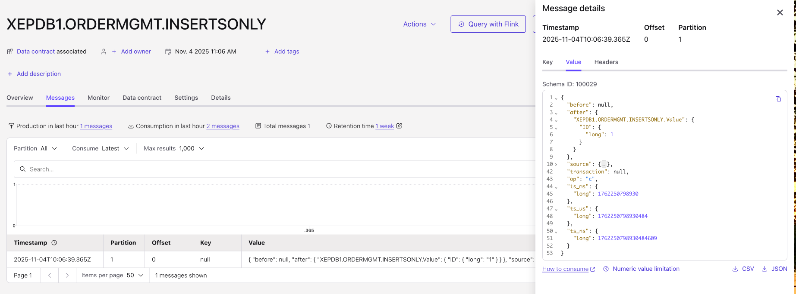
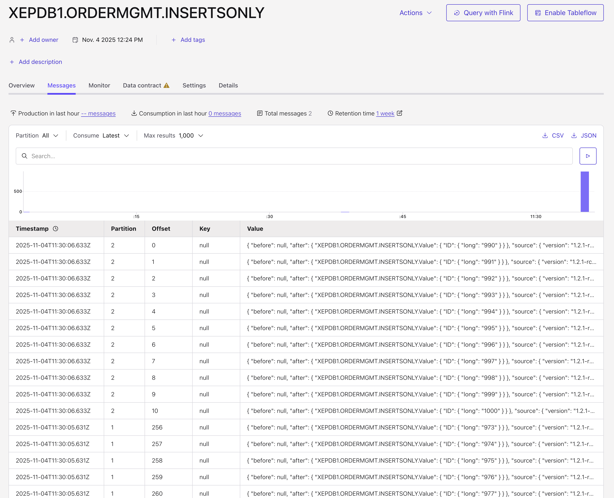

# Transfer only inserts from Oracle to Confluent Cloud

Customers asking if it is possible to transfer only inserts? Yes, it is.
If you have this scenario, you will think that it would make sense to create topics with more than one partition. This correct thinking. You can have more partitions now, because you do need an orderning anymore.

This demo will also show, that not supported datatypes are automatically dropped e.g. an XMLTYPE data type.

Pre-reqs:
* Confluent Cluster is runnnig
* Oracle Database XE is running, without Outbound Server
* Drop CDC Connector

If your database has a running Outbound Server from my demo, drop it please.

```bash
SQL> connect c##ggadmin@XE
# Password Confluent12!
# Drop outbound
SQL> execute DBMS_XSTREAM_ADM.DROP_OUTBOUND('xout');
```

No, we will add a new table into the database for INSERTS only cased:

```bash
SQL> connect ordermgmt/kafka@XEPDB1 
SQL> CREATE TABLE INSERTSONLY (id NUMBER(10,0), TEXTXML XMLTYPE);
```

No data is added so far. We wait later for inserts. Let's start the Outbound Server

```bash
SQL> connect c##ggadmin@XE
# Password is Confluent12!

SQL> DECLARE
  tables  DBMS_UTILITY.UNCL_ARRAY;
  schemas DBMS_UTILITY.UNCL_ARRAY;
BEGIN
    tables(1)   := 'ORDERMGMT.INSERTSONLY';
    tables(2)  := NULL;
    schemas(1)  := NULL;        
  DBMS_XSTREAM_ADM.CREATE_OUTBOUND(
    capture_name          =>  'confluent_xout1',
    server_name           =>  'xout',
    source_container_name =>  'XEPDB1',   
    table_names           =>  tables,
    schema_names          =>  schemas,
    comment               => 'Confluent Xstream CDC Connector' );
    -- set retention
    DBMS_CAPTURE_ADM.ALTER_CAPTURE(
      capture_name => 'confluent_xout1',
      checkpoint_retention_time => 1);
    -- STREAM POOL SIZE should be 1024, in XE 256, Capture
    DBMS_XSTREAM_ADM.SET_PARAMETER(
    streams_type => 'capture',
    streams_name => 'confluent_xout1',
    parameter    => 'max_sga_size',
    value        => '256');
    -- STREAM POOL SIZE should be 1024, in XE 256, Outbound
    DBMS_XSTREAM_ADM.SET_PARAMETER(
    streams_type => 'apply',
    streams_name => 'xout',
    parameter    => 'max_sga_size',
    value        => '256');
END;
/
```

Now, we create a new topic `XEPDB1.ORDERMGMT.INSERTSONLY` with 3 partitions.

Now, start the connector for getting only inserts, before doing that we changed the config of `cflt_connectors.tf` and skipping operations, changed snapshot and the include tables.

```json
"table.include.list"                = "ORDERMGMT[.](INSERTSONLY)"
"snapshot.mode"                     = "no_data"
"skipped.operations"                = "t,u,d"
```

Now, run the connector.
And do insert and updates etc.

```bash
SQL> connect ordermgmt/kafka@XEPDB1 
SQL> INSERT INTO INSERTSONLY(ID) values (1);
SQL> commit;
SQL> SELECT * FROM INSERTSONLY;
SQL> UPDATE INSERTSONLY set ID=2;
SQL> commit;
SQL> INSERT INTO INSERTSONLY(ID) values (2);
SQL> commit;
SQL> begin
      for x in 3..1000 loop
        insert into insertsonly(id) values (x);
        commit; 
      end loop;
    end;
    /
```

In Confluent Cloud Topic Viewer we will see that the column XMLTYPE was dropped automatically and only INSERTs were sychned with Confluent Cloud Topic.



No others records then INSERTS are transformed. The data in splitted into partitions



