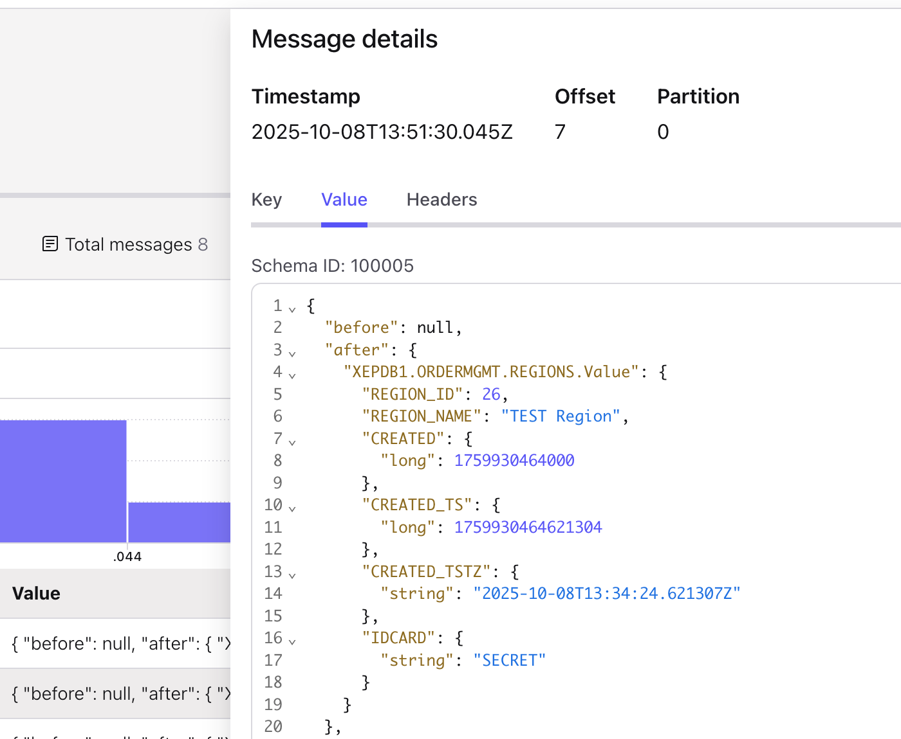

# Setup TDE in Oracle and use it with COnfluent Oracle XStream CDC Source Connector

We will setup TDE in Oracle DB for tablespace and columns and see if these work with our XStream Connector.

```bash
ssh -i ~/keys/cmawsdemoxstream.pem ec2-user@35.159.83.138
sudo docker exec -it oracle21c /bin/bash
sqlplus sys/confluent123 as sydba
SQL> !mkdir -p $ORACLE_HOME/admin/$ORACLE_SID/wallet
SQL> !echo 'ENCRYPTION_WALLET_LOCATION=
 (SOURCE=
  (METHOD=FILE)
   (METHOD_DATA=
    (DIRECTORY=/opt/oracle/product/21c/dbhomeXE/admin/XE/wallet/)))' > /opt/oracle/product/21c/dbhomeXE/network/admin/sqlnet.ora
SQL> alter system set wallet_root='/opt/oracle/product/21c/dbhomeXE/admin/XE/wallet' scope=spfile;    
SQL> alter system set tde_configuration='KEYSTORE_CONFIGURATION=FILE' scope=both;
SQL> !mkdir /opt/oracle/product/21c/dbhomeXE/admin/XE/wallet/tde

SQL> ADMINISTER KEY MANAGEMENT CREATE KEYSTORE IDENTIFIED BY confluent123;
SQL> !ls -l /opt/oracle/product/21c/dbhomeXE/admin/XE/wallet/tde
# -rw-------. 1 oracle oinstall 2555 Oct  8 12:03 ewallet.p12
# Then create a password for the software keystore
SQL> ADMINISTER KEY MANAGEMENT CREATE KEYSTORE '/opt/oracle/admin/XE/confluent_tde_wallet'  IDENTIFIED BY confluent123;
SQL> !ls -l /opt/oracle/product/21c/dbhomeXE/admin/XE/wallet
# -rw-------. 1 oracle oinstall 2555 Oct  8 12:05 ewallet.p12
# drwxr-x---. 2 oracle oinstall   25 Oct  8 12:03 tde
# -Create the auto-login or local auto-login
SQL> ADMINISTER KEY MANAGEMENT CREATE AUTO_LOGIN KEYSTORE FROM KEYSTORE '/opt/oracle/product/21c/dbhomeXE/admin/XE/wallet/tde' IDENTIFIED BY confluent123;
# A .sso file should exist now
SQL> !ls -l /opt/oracle/product/21c/dbhomeXE/admin/XE/wallet/tde
# -rw-------. 1 oracle oinstall 2600 Oct  8 12:06 cwallet.sso
# -rw-------. 1 oracle oinstall 2555 Oct  8 12:03 ewallet.p12
# open the keystore on CDB
SQL> alter session set container=CDB$ROOT;
SQL> ADMINISTER KEY MANAGEMENT SET KEYSTORE OPEN IDENTIFIED BY "confluent123";
# open the keystore on PDB1
SQL>  show pdbs
#     CON_ID CON_NAME                       OPEN MODE  RESTRICTED
# ---------- ------------------------------ ---------- ----------
#          2 PDB$SEED                       READ ONLY  NO
#          3 XEPDB1                         READ WRITE NO
SQL> alter session set container=XEPDB1;
SQL> ADMINISTER KEY MANAGEMENT SET KEYSTORE OPEN IDENTIFIED BY "confluent123";
SQL> SELECT CON_ID, Status, KEYSTORE_MODE FROM V$ENCRYPTION_WALLET;
#     CON_ID STATUS                         KEYSTORE
# ---------- ------------------------------ --------
#          3 OPEN_NO_MASTER_KEY             UNITED
# Create master key for container database (CDB) and all pluggable databases (PDBs).
SQL> alter session set container=CDB$ROOT;
SQL> administer key management set key identified by confluent123 with backup container=ALL;
SQL> alter session set container=XEPDB1;
SQL> CREATE TABLESPACE TS_ENCRYPTED DATAFILE '/opt/oracle/oradata/XE/ts_encrytped.dbf' SIZE 11M ENCRYPTION USING  'AES256' ENCRYPT;
SQL> select tablespace_name , encrypted from dba_tablespaces;
# TABLESPACE_NAME                ENC
# ------------------------------ ---
# SYSTEM                         NO
# SYSAUX                         NO
# UNDOTBS1                       NO
# TEMP                           NO
# USERS                          NO
# TS_ENCRYPTED                   YES
# SO, Tablespace encryption is tsraight forward, There should no problems with XStream Connector, let play with columns based encrpytion
SQL> SELECT CON_ID,MASTERKEY_ACTIVATED FROM V$DATABASE_KEY_INFO;
#     CON_ID MAS
# ---------- ---
#          3 YES
SQL>  connect ordermgmt/kafka@XEPDB1
SQL> select * from cat;
TABLE_NAME                                                                                                                       TABLE_TYPE
-------------------------------------------------------------------------------------------------------------------------------- -----------
REGIONS                                                                                                                          TABLE
COUNTRIES                                                                                                                        TABLE
LOCATIONS                                                                                                                        TABLE
WAREHOUSES                                                                                                                       TABLE
EMPLOYEES                                                                                                                        TABLE
PRODUCT_CATEGORIES                                                                                                               TABLE
PRODUCTS                                                                                                                         TABLE
CUSTOMERS                                                                                                                        TABLE
CONTACTS                                                                                                                         TABLE
ORDERS                                                                                                                           TABLE
ORDER_ITEMS                                                                                                                      TABLE
INVENTORIES                                                                                                                      TABLE
NOTES   
SQL> desc regions;
# Name          TYPE       
# -----------   ---------------------------------------------
# REGION_ID      NUMBER(10)
# REGION_NAME    VARCHAR2(50)
# CREATED        DATE
# CREATED_TS     TIMESTAMP(6)
# CREATED_TSTZ   TIMESTAMP(6) WITH TIME ZONE
SQL> alter table regions add (idcard varchar(12) encrypt);
SQL> desc regions:
# IDCARD   VARCHAR2(12) ENCRYPT
SQL> insert into regions (REGION_NAME, idcard) values ('TEST Region', 'SECRET');
SQL> commit;
SQL> select region_name, idcard from ordermgmt.regions;
SQL> connect c##ggadmin@XEPDB1
SQL> select region_name, idcard from ordermgmt.regions;
# REGION_NAME                                        IDCARD
# -------------------------------------------------- ------------
# ...
# TEST Region                                        SECRET
# TEST9
```

My connector user could be read the encrypted column. So, lets start the Outbound Server and the connector.


```bash
SQL> connect c##ggadmin@XE
# Drop outbound
SQL> exec dbms_xstream_adm.drop_outbound('xout');
# In Confluent Cloud drop Connector and topics
# Create a new Outbound Server
SQL> DECLARE
  tables  DBMS_UTILITY.UNCL_ARRAY;
  schemas DBMS_UTILITY.UNCL_ARRAY;
BEGIN
    tables(1)  := 'ORDERMGMT.REGIONS';
    tables(2)  := NULL;
    schemas(1) := NULL;
  DBMS_XSTREAM_ADM.CREATE_OUTBOUND(
    capture_name          =>  'confluent_xout1',
    server_name           =>  'xout',
    source_container_name =>  'XEPDB1',   
    table_names           =>  tables,
    schema_names          =>  schemas,
    comment               => 'Confluent Xstream CDC Connector' );
    -- set retention
    DBMS_CAPTURE_ADM.ALTER_CAPTURE(
      capture_name => 'confluent_xout1',
      checkpoint_retention_time => 1);
    -- STREAM POOL SIZE should be 1024, in XE 256, Capture
    DBMS_XSTREAM_ADM.SET_PARAMETER(
    streams_type => 'capture',
    streams_name => 'confluent_xout1',
    parameter    => 'max_sga_size',
    value        => '256');
    -- STREAM POOL SIZE should be 1024, in XE 256, Outbound
    DBMS_XSTREAM_ADM.SET_PARAMETER(
    streams_type => 'apply',
    streams_name => 'xout',
    parameter    => 'max_sga_size',
    value        => '256');
END;
/
```

And now you can start the connector as well. We will see that data is unecrypted in Confluent Cloud Topic



If you do not want that data is decrypted in topics now, then you need to implement [CSFLE](https://docs.confluent.io/cloud/current/connectors/csfle.html).